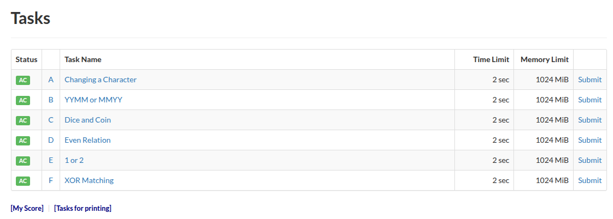
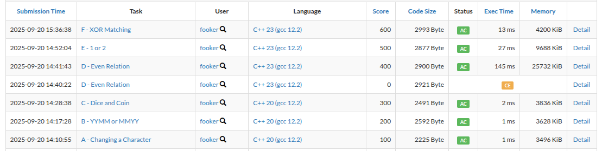

Today is 20th September, 2025. I'm going to upsolve this <a href="https://atcoder.jp/contests/abc126/tasks">contest</a> (AtCoder ABC 126)



## Problem A <a href="https://atcoder.jp/contests/abc126/tasks/abc126_a">[Link]</a>

straightforward. I'm going to use the fact that lowercase characters are offsetted at 32 from uppercase characters in the ASCII table.

{}
```c++
void solve() {
    int n, k;
    std::cin >> n >> k;
    
    std::string s;
    std::cin >> s;

    s[k - 1] = (char)((int)s[k - 1] + 32);
    std::cout << s << '\n';
}
```
{}

## Problem B <a href="https://atcoder.jp/contests/abc126/tasks/abc126_b">[Link]</a>

this is straightforward too. i'm going to slice it into two numbers and then we check if it falls in the range `[1, 12]`.

{}
```c++
void solve() {
    std::string s;
    std::cin >> s;

    int first = (s[1] - '0') + (s[0] - '0') * 10;
    int second = (s[3] - '0') + (s[2] - '0') * 10;

    if ((first >= 13 || first <= 0) && (second >= 13 || second <= 0)) {
        std::cout << "NA\n";
    } else if ((first >= 13 || first <= 0) && (second < 13 || second > 0)) {
        std::cout << "YYMM\n";
    } else if ((first < 13 && first > 0) && (second >= 13 || second <= 0)) {
        std::cout << "MMYY\n";
    } else {
        std::cout << "AMBIGUOUS\n";
    }
}
```
{}

## Problem C <a href="https://atcoder.jp/contests/abc126/tasks/abc126_c">[Link]</a>

so if the first number is $ \geq k$ then we are done with probability $1 / n$. otherwise, the probability is $1/(n \times 2^r)$ where $r$ is the smallest number such that $i \times 2^r \geq k$

{}
```c++
void solve() {
    int n, k;
    std::cin >> n >> k;

    double ans = 0;
    if (n >= k) {
        ans += (double)(n - k + 1) / n;
    }

    for (int i = 1; i <= std::min(n, k - 1); i++) {
        int cnt = 0, temp = i;
        while (temp < k) {
            cnt++;
            temp *= 2;
        }

        ans += (double)1 / (n * (1 << cnt));
    }

    std::cout << std::fixed << std::setprecision(15) << ans << '\n';
}
```
{}

## Problem D <a href="https://atcoder.jp/contests/abc126/tasks/abc126_d">[Link]</a>
The first observation is that if there exists a colouring, then there exists two of them. this is because we can switch each node coloured white to black and black to white.

Therefore, we can fix the root of the tree and colour it white without loss of generality. Since the weights are fixed, therefore traversing down the tree using any tree traversal algorithms would successively fix the colours of subsequent nodes depending upon the colour of the parent node and the weight of the edge joining the node and its parent. 

I chose to implement a dfs solution since it felt straightforward to me.

{}
```c++
void solve() {
    int n;
    std::cin >> n;

    std::vector<int> adj[n + 1];
    std::map<std::pair<int, int>, int> mp;
    for (int i = 1, x, y, z; i < n; i++) {
        std::cin >> x >> y >> z;

        adj[x].push_back(y);
        adj[y].push_back(x);

        mp[{x, y}] = z;
        mp[{y, x}] = z;
    }

    std::vector<int> ans(n + 1, -1);
    std::function<void(int, int)> dfs = [&](int p, int u) -> void {
        if (p == -1) {
            ans[u] = 0;
        }

        for (auto v: adj[u]) {
            if (p == v) continue;
            if (mp[{u, v}] % 2) {
                ans[v] = 1 - ans[u];
            } else {
                ans[v] = ans[u];
            }
            dfs(u, v);
        }
    };
    dfs(-1, 1);

    for (int i = 1; i <= n; i++) {
        std::cout << ans[i] << '\n';
    }
}
```
{}

## Problem E <a href="https://atcoder.jp/contests/abc126/tasks/abc126_e">[Link]</a>

lmao this is a really cute problem. i immediately see what's to be done here. to motivate the solution, notice what would happen if suppose `z_i` is even. that would force `A_{x_i} + A_{y_i}` to be even. and there are only two possibilities then (either `(1, 1)` or `(2, 2)`). In constrast, if `z_i` is odd then `A_{x_i} + A_{y_i}` is odd and again there are two possibilities, either `(1, 2)` or `(2, 1)`. so in either case we need to use a magic to determine what the correct values are. 

if we look at these $m$ constraints, they are basically edges drawn on a graph with $n$ nodes and if know any one number in a connected component, we can determine all the connected nodes using the above rules. therefore, the answer is just the number of connected components. and as it turns out, the information about $z$ was completely irrelevant. 

{}
```c++
void solve() {
    int n, m;
    std::cin >> n >> m;

    std::vector<int> adj[n + 1];
    for (int i = 1, x, y, z; i <= m; i++) {
        std::cin >> x >> y >> z;

        adj[x].push_back(y);
        adj[y].push_back(x);
    }

    std::vector<int> vis(n + 1, 0);
    int cnt = 0;
    
    for (int i = 1; i <= n; i++) {
        if (vis[i] == 0) {
            cnt++;
            vis[i] = 1;

            std::queue<int> q;
            q.push(i);

            while (q.size()) {
                int s = q.front();
                q.pop();

                for (auto u: adj[s]) {
                    if (vis[u] == 0) {
                        vis[u] = 1;
                        q.push(u);
                    }
                }
            }
        }
    }

    std::cout << cnt << '\n';
}
```
{}

## Problem F <a href="https://atcoder.jp/contests/abc126/tasks/abc126_f">[Link]</a>

this is a nice problem. i got the intuition by solving smaller subcases. the idea here is that the xor of all numbers from `0` to `2^m - 1` is `0`. therefore, if we skip `k` from there, the xor of all the other numbers is `k`. hence we can fit all the numbers between two `k` at the sides and the append the remaining numbers in the reverse order. the answer does not exist when `k` is greater than `2^m - 1` or `m = k = 1`

{}
```c++
template<typename T>
auto reversed(T& container) {
    return std::vector<typename T::value_type>(container.rbegin(), container.rend());
}

void solve() {
    int m, k;
    std::cin >> m >> k;

    if (k >= (1LL << m)) {
        std::cout << -1 << '\n';
    } else {
        if (m == 1) {
            if (k == 0) {
                std::cout << "0 1 1 0\n";
            } else {
                std::cout << -1 << '\n';
            }
        } else {
            std::vector<int> temp;
            for (int i = 0; i < (1LL << m); i++) {
                if (i != k) {
                    temp.push_back(i);
                }
            }

            for (auto u: temp) {
                std::cout << u << ' ';
            }

            std::cout << k << ' ';

            for (auto u: reversed(temp)) {
                std::cout << u << ' ';
            }

            std::cout << k << '\n';
        }
    }
}
```
{}

And with that we complete upsolving the contest!


