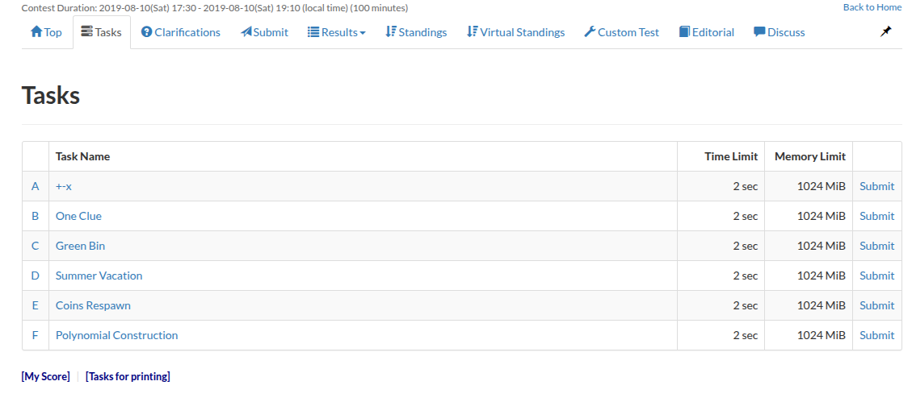
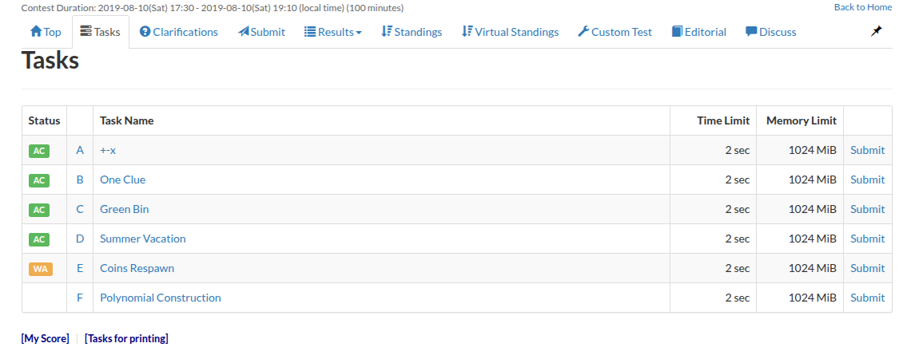
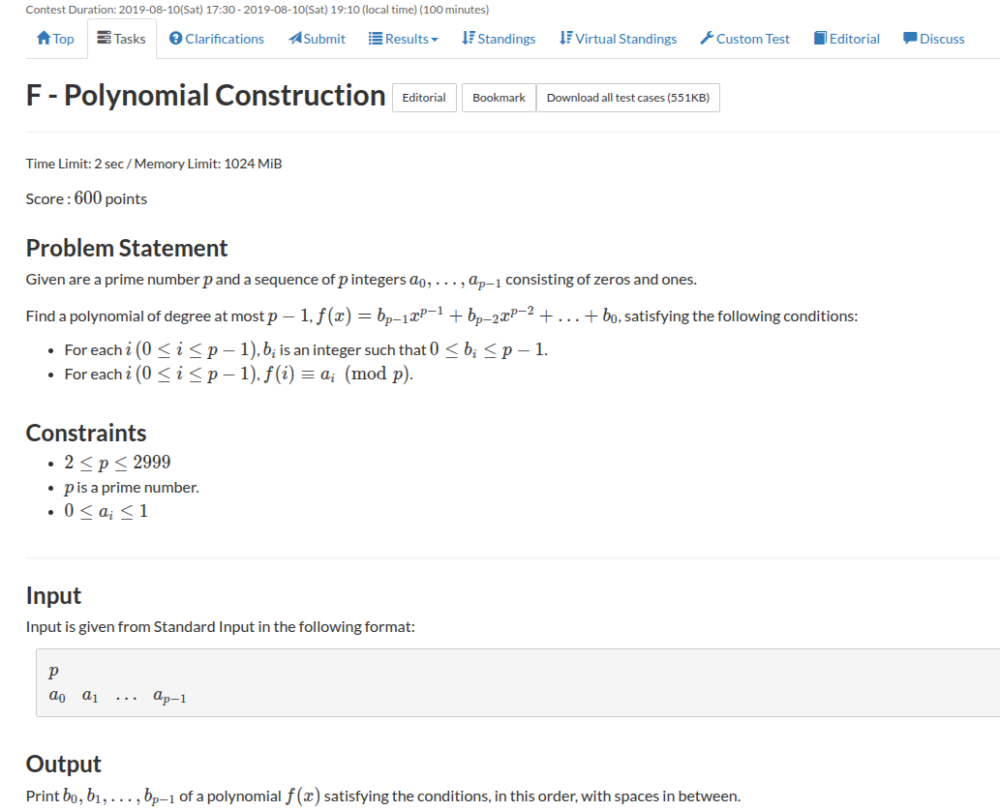
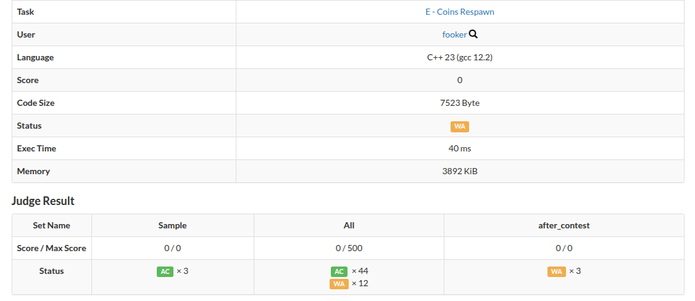

Today is 21st September, 2025 and I'm going to upsolve this <a href="https://atcoder.jp/contests/abc137">contest</a> (AtCoder ABC 137).



## Problem A <a href="https://atcoder.jp/contests/abc137/tasks/abc137_a">[Link]</a>

very trivial. just take the maximum of all three.

{}
```c++
void solve() {
    ll a, b;
    std::cin >> a >> b;

    std::cout << std::max({a + b, a - b, a * b}) << '\n'; 
}  
```
{}

Submission Link: https://atcoder.jp/contests/abc137/submissions/69526851

## Problem B <a href="https://atcoder.jp/contests/abc137/tasks/abc137_b">[Link]</a>

this is easy too. just print all numbers from `x - k + 1` to `x + k - 1`


{}
```c++
void solve() {
    int k, x;
    std::cin >> k >> x;

    for (int i = x - k + 1; i <= x + k - 1; i++) {
        std::cout << i << ' ';
    }
}
```
{}

Submission Link: https://atcoder.jp/contests/abc137/submissions/69526877

## Problem C <a href="https://atcoder.jp/contests/abc137/tasks/abc137_c">[Link]</a>

This problem caught me slacking hard. I wasn't really looking at the constraints and in a hurry I just read the problem and implemented an `O(N^2)` solution that checked the frequencies for each letter in a pair of strings. However, then I got a TLE and then I read the constraints lmao.

Then I hit on the right approach. Since the lengths of the string are small, we can just sort these and store them in a map. And just count the number of occurences for each string as we iterate over the list of strings. I still received two Wrong submissions because I was very careless with Integer Overflow here.

Here's the correct implementation:

{}
```c++
void solve() {
    ll n;
    std::cin >> n;

    std::string s[n + 1];
    for (int i = 1; i <= n; i++) {
        std::cin >> s[i];
        std::sort(s[i].begin(), s[i].end());
    }

    ll cnt = 0;
    std::map<std::string, ll> mp;
    for (int i = 1; i <= n; i++) {
        cnt += mp[s[i]];
        mp[s[i]]++;
    }

    std::cout << cnt << '\n';
}
```
{}

Submission Link: https://atcoder.jp/contests/abc137/submissions/69527049

## Problem D <a href="https://atcoder.jp/contests/abc137/tasks/abc137_d">[Link]</a>

### Some Background
I immediately recognised this as the very same problem that was asked to me in my Goldman Sachs Intership On-Campus Interviews Round 1. That was one year ago and I didn't remember much now. But I think I still got stuck on the same issue as back then. Here's my complete thought process:

So for every passing day, each job is getting closer to the expiry. So if today is day `i` then we can only get rewards from jobs with `day <= m - i` and at any day `i` we should pick atmost one job. Is it optimal to pick a job that would give us the highest reward among the jobs left or should we pick up the highest reward among those that are going to expire soon. That is should we sort by `B` and then by `A` or should we sort by `A` and then by `B`. 

I got dead stuck in this approach. These types of problems have always been my weakness, my chaotic mind is really not able to play out well with opposing contradicting variables of motions. It's like it plays tug of war in my mind. 

Nevertheless, I implemented both the approaches that I could figure out and submitted and both of them gave my a Wrong Answer (WA) lmfao.

Then I read the editorial. The very beautiful and insightful editorial I've ever read (no sarcasm, I'm gonna link it here: https://img.atcoder.jp/abc137/editorial.pdf). Here's my own attempt at describing the idea.


### Idea
We will construct the solution backwards. Let's start from just one day before day `M`. we only have those jobs in our reach that will reward us in `1` day. What would we do? We would pick up those with highest rewards in this set. Then we move to day `2`. We have more possible jobs now. We will pick the highest from here. And so on. At every stage we are adding jobs that are permissible and then picking up the maximum from it. And no, this is not the same as picking up the maximum from all possible jobs when iterating in the forward direction. The order of picking up jobs changes and that actually gives you a Wrong Answer. 

To implement this, We will need to store all the jobs that expire on the `i`th day in a list and start iterating backwards, on each `i`th day, add all those jobs from the list to a priority queue that sorts jobs with highest reward and then by earliest expiry (actually this doesn't even matter) and just pick the highest rewarding job as long as you can.

Wow, that was actually very educational. There's another approach in the editorial that explains why a greedy strategy might work on this problem. It proves that the operations defined in this premise actually define a matroid and using the greedy algorithm on matroid we can actually work out this same exact solution.

### Implementation
{}
```c++
void solve() {
    ll n, m;
    std::cin >> n >> m;

    ll a[n + 1], b[n + 1];
    for (int i = 1; i <= n; i++) {
        std::cin >> a[i] >> b[i];
    }

    int day = 1, ans = 0;
    std::priority_queue<ll> pq;
    std::map<ll, std::vector<ll>> mp;
    for (int i = 1; i <= n; i++) {
        mp[a[i]].push_back(b[i]);
    }

    for (; day <= m; day++) {
        for (auto u: mp[day]) {
            pq.push(u);
        }
        if (pq.size()) {
            ans += pq.top();
            pq.pop();
        }
    }

    std::cout << ans << '\n';
} 
```
{}

Submission Link: https://atcoder.jp/contests/abc137/submissions/69538875

## Problem E <a href="https://atcoder.jp/contests/abc137/tasks/abc137_e">[Link]</a>

I immediately boiled down the condition of penalty of `TxP` to penalising all the edges of the graph by `P`. I realised that this might cause the graph edges to become negative weighted and therefore, we can no longer use `Dijkstra's algorithm` to determine the shortest length path. In such cases, it's a very well known fact that we use `Bellman-Ford's algorithm` but I'm really so rusty. I don't even remember how do you implement it.

So I decided to read about Bellman-Ford's Algorithm here: https://cp-algorithms.com/graph/bellman_ford.html

Then i implemented the following helper class for obtaining the shortest path distance vector using bellman-ford for a source node
```c++
// for bellman ford algorithm
struct Edge {
    int x;
    int y;
    int cost;
    Edge(int x, int y, int cost) : x(x), y(y), cost(cost) {}
};

class Bellman_Ford {
    // everything is 1-indexed
private:
    int source;
    int n;
    std::vector<struct Edge> edges;

public:
    int negative_cycle = 0;
    std::vector<ll> parent;

    Bellman_Ford(int u, int n, std::vector<struct Edge> edges): source(u), n(n), edges(edges), parent(n + 1, -1) {}

    std::vector<ll> run() {
        std::vector<ll> dist(n + 1, LLONG_MAX);
        
        // initialise the distance vector
        dist[source] = 0;

        for (int i = 1; i <= n; i++) {
            int flag = -1;

            for (auto edge: edges) {
                if (dist[edge.x] < LLONG_MAX) {
                    if (dist[edge.y] > dist[edge.x] + edge.cost) {
                        dist[edge.y] = std::max(LLONG_MIN, dist[edge.x] + edge.cost);
                        parent[edge.y] = edge.x;
                        flag = edge.y;
                    }
                }
            }

            if (flag == -1) break;
            if (i == n) {
                negative_cycle = flag;
            }
        }

        return dist;
    }
};
```

and I believe the algorithm is correct, but my submission gives a wrong answer: https://atcoder.jp/contests/abc137/submissions/69535537

I think I'll have to work out the theory and learn how to apply Bellman-Ford along with all the proofs. I'm gonna write a blog post about this that teaches bellman-ford along with the nitty gritty implementation tactics etc.

for now, the time is up and I'm still another problem short :(





## Problem F <a href="https://atcoder.jp/contests/abc137/tasks/abc137_f">[Link]</a>



# [UPD]: 23rd September, 2025
I'm going to try attempting the remaining two problems (E and F) again. I feel like I might be able to learn a lot from this, so I'm going to attempt these problems.

## Problem E <a href="https://atcoder.jp/contests/abc137/tasks/abc137_e">[Link]</a>
So, continuing from the last time's progress we need to debug the bellman ford code that I had. I'm not really sure if it's something to do with the `Bellman Ford Algorithm` or is my usage of it kinda wrong.

Let's take a look at the WA


I have about `15/59` WA and these are on bigger testcases, so my initial guess was that I might be suffering from an integer overflow (since I'm using `int`). but changing that to `i64` doesn't really do anything: https://atcoder.jp/contests/abc137/submissions/69573722

It's still `15/59`.

Then I analysed my logic a bit more carefully. We say that a maximum value is never achievable when there is a negative weight cycle. Simply the existence of a negative weight cycle is not correct to determine if the answer is unbounded. We have to make sure that either the cycle lies on a path from `1` to `n` or it is possible to reach the cycle from `n` and back to `n`. In both the cases, the cycle should have a path to `n` and there should also be a path from `1` to the cycle. 

I changed the condition from `parents.count(n)` to `parents.count(n) || parents.count(1)` and now I get `11/59` WA: https://atcoder.jp/contests/abc137/submissions/69573810

I still think that I'm not correct about this modification. Let's think again. So, let's observe what happens to the parent array at the `n`th operation. It's guaranteed that if a cycle exists, it is reachable from `1` (because reduction only happens when a finite distance is found which is only possible when a path from `1` exists). So what if we try to collect the `n` nodes on the paths traversing back to the parents and check if any of this node lie in the cycle?

I implemented this condition and now I get `5/59` WA: https://atcoder.jp/contests/abc137/submissions/69575779

I'm still thinking what am I missing. I modified the bellman ford algorithm to detect any relaxation to the answer computed for `dist[n]`. We know that in `n - 1` iterations it should compute the shortest path to node `n`. if we try to run the algorithm for more `n` iterations, and check if the value that we saved is equal to the value in `dist[n]`, that should help us identify if negative cycles are affecting `dist[n]`.

I implemented this and it passes testcases on the contest, however it fails on the after contest testcases. Infact a lot of the solutions on the leaderboard that use Bellman Ford's algorithm use this modified idea and all of them fail on the after contest testcases that were, I suppose, deliberately added as counter examples to these hacky fixes.

The only solution on the leaderboard that I saw that didn't fail was the one that used `SPFA algorithm` (Shortest Path Faster Algorithm).

### What is SPFA?
SPFA is an improvement of the Bellman-Ford algorithm which takes the advantage of the fact that not all attempts at relaxation will work in bellman ford.

The main idea is to create a queue containing only the vertices that were relaxed but that still could further relax their neighbours. SPFA is used to detect negative cycles and has the same worst case time complexity as Bellman Ford's algorithm, but in practice it works much faster.

I still need to process this solution. At the moment, I just feel like SPFA is kinda like BFS. I implemented my own template for SPFA but that throws a wrong answer when submitted. This guy implements SPFA but his solution works: https://atcoder.jp/contests/abc137/submissions/6820913

## Problem F <a href="https://atcoder.jp/contests/abc137/tasks/abc137_f">[Link]</a>

Okay, I just read Problem F. isn't this like just lagrange interpolation on primes? This should be very very standard, people must have templates ready for this.

anyway, I don't think there's anything interesting with this problem. I'm skipping this.

