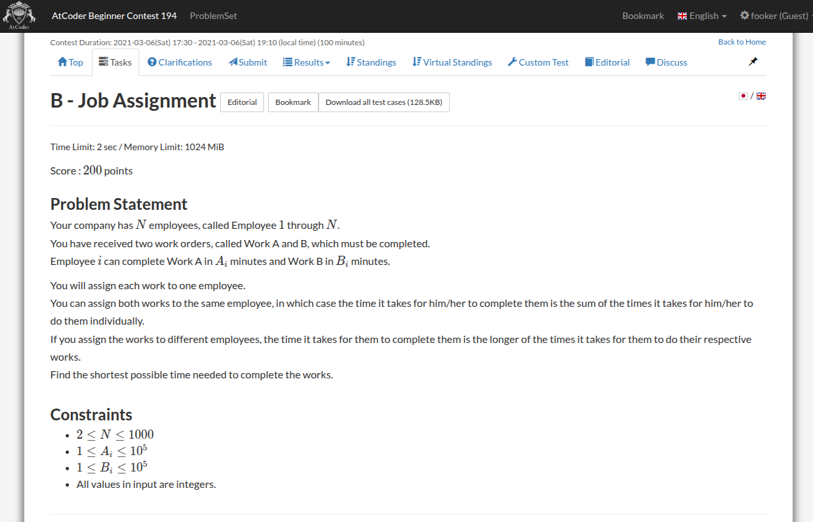
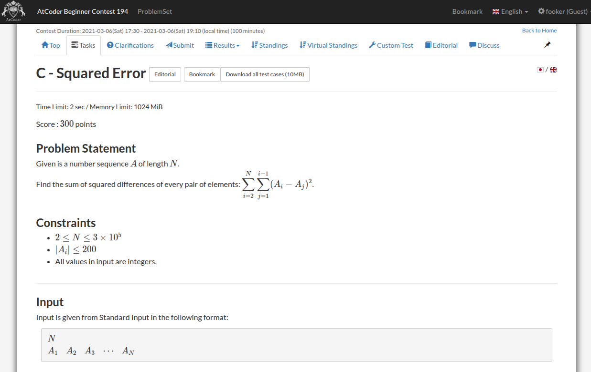

Today is 23rd September, 2025 and I'm going to upsolve the contest <a href="https://atcoder.jp/contests/abc194/tasks">ABC 194</a>


## Problem A <a href="https://atcoder.jp/contests/abc194/tasks/abc194_a">[Link]</a>


this is so stupid. just implement what's given

{}
```c++
void solve() {
    ll a, b;
    std::cin >> a >> b;

    if (a + b >= 15 && b >= 8) {
        std::cout << 1 << '\n';
    } else if (a + b >= 10 && b >= 3) {
        std::cout << 2 << '\n';
    } else if (a + b >= 3) {
        std::cout << 3 << '\n';
    } else {
        std::cout << 4 << '\n';
    }
}
```
{}

Submission Link: https://atcoder.jp/contests/abc194/submissions/69579215

## Problem B <a href="https://atcoder.jp/contests/abc194/tasks/abc194_b">[Link]</a>



I was going to write a `O(N)` approach using prefix and suffix minima but then I read the constraints and just did a dumb `O(N^2)` lmao. 

the idea is we first compute the answer for same eployee then for different employee

{}
```c++
void solve() {
    ll n;
    std::cin >> n;

    std::vector<ll> a(n + 1, 0), b(n + 1, 0);
    for (ll i = 1; i <= n; i++) {
        std::cin >> a[i] >> b[i];
    }

    ll ans = LLONG_MAX;
    for (ll i = 1; i <= n; i++) {
        ans = std::min(ans, a[i] + b[i]);
    }

    for (ll i = 1; i <= n; i++) {
        for (ll j = 1; j <= n; j++) {
            if (i == j) continue;
            ans = std::min(ans, std::max(a[i], b[j]));
        }
    }

    std::cout << ans << '\n';
}
```
{}

Submission Link: https://atcoder.jp/contests/abc194/submissions/69579254

## Problem C <a href="https://atcoder.jp/contests/abc194/tasks/abc194_c">[Link]</a>



just simplify the expression. it boils down to `(n - 1) sum a_i^2 - sum a_i (total_sum - a_i)` which can be computed in `O(N)`

{}
```c++
void solve() {
    ll n;
    std::cin >> n;

    std::vector<ll> a(n + 1, 0);
    for (ll i = 1; i <= n; i++) {
        std::cin >> a[i];
    }

    ll sq = 0, sum = 0;
    for (ll i = 1; i <= n; i++) {
        sq += a[i] * a[i];
        sum += a[i];
    }

    sq *= (n - 1);
    for (ll i = 1; i <= n; i++) {
        sq -= (a[i] * (sum - a[i]));
    }

    std::cout << sq << '\n';
}
```
{}

Submission Link: https://atcoder.jp/contests/abc194/submissions/69579313

## Problem D <a href="https://atcoder.jp/contests/abc194/tasks/abc194_d">[Link]</a>


interesting. since the probabilities of choosing any vertex is equal, we just have to compute the number of edges, and sum these for all possible solutions.

one approach i see is dynamic programming, what if `dp[n]` is the required answer. any edge that connects `n` to point `i` would make the graph connected. if we know that answer for `dp[n - 1]` how can we compute `dp[n]`. we also know that takahashi is on vertex `n - 1` after `dp[n - 1]` moves. if he wants to reach `n` in one move, that would be just one possibility. if he has to do it in `2` moves: then there are (n - 1) possibilities. and similarly for `3` moves i see `(n - 1)^2` moves. it just feels like to me that we have the following dp: `dp[i] = dp[i - 1] + sum_{j = 1} (i - 1)^j / n^{j + 1}`

oh but that doesn't work either. maybe im making mistake by assuming there exists only a single choice when in reality there exist `(n - i + 1)` nodes to jump to for `dp[i]`. that modifies the dp to: `dp[i] = dp[i - 1] + (n - i + 1) / n \sum_{j = 0} (i - 1)^j / n^j`

oh wtf i got my mistake i wasn;t accounting for the number of moves in the expected value formula. if you do that, this turns into an arithmetic geometric progression which simplifies to `dp[i] = dp[i - 1] + n / (n - i + 1)`

{}
```c++
void solve() {
    ll n;
    std::cin >> n;

    double ans = 0.0;
    for (ll i = 2; i <= n; i++) {
        ans = ans + (double)(n) / (n - i + 1);
    }

    std::cout << std::fixed << std::setprecision(15) << ans << '\n';
}
```
{}

Submission Link: https://atcoder.jp/contests/abc194/submissions/69584013
