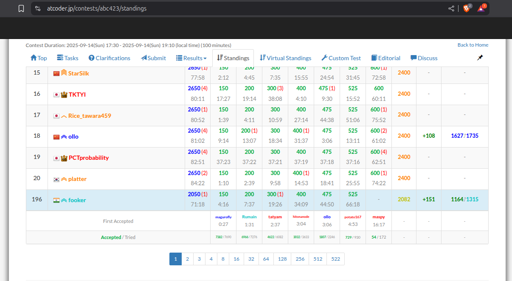

# AtCoder ABC 423

Today, I participated as a rated participant in <a href="https://atcoder.jp/contests/abc423/tasks">ABC 423</a> and I managed to solve 6 out 7 problems. In this post, I'm going to talk about what I felt about each problem, briefly discuss about the ideas and cool tricks I learnt.

|  | 
|:--:| 
| *Performance* |

## Problem A

The language for this problem was quite confusing. I spent the first two minutes trying to understand what was I supposed to compute. Out of frustration I gave up and looked up the explanation in the examples. Through the explanation in the examples, I was able to figure out an algorithm to compute the required quantity.

Nothing too great about this problem. 

## Problem B

Pretty straightforward. You just had to compute the maximum you can traverse from the left-most and right-most end and the count the number of rooms in between them. Trivial.

## Problem C

I had to think twice about this. Greedily, it seemed that you would choose the nearest end and walk back to the start and end up with closing all the doors on the other end. However, mathematically writing out the expression revealed that it doesn't matter as long as you move optimally (that is, a locked door would be operated on twice if you need to go past it to lock an unlocked door. And an unlocked door, would be only operated on a single time!). I'd say I liked this problem slightly!

## Problem D

As soon as I read the problem, I had a feeling that this could be solved using an online algorithm (that is we can compute the answer for each query on the fly). the answers for the subsequent queries would be dependent on the answer of the previous query.

And as it turns out, you just have to maintain a sorted list of groups inside the restaurant. As long as you can fit groups inside, the groups will enter at their designated arrival time. When you cannot, you keep popping off groups that will leave the earliest, until there is enough room for the front facing group to enter. This is just implementation at this point. 

## Problem E

I had seen this problem before hand somewhere. It is kinda stupid that this appeared on an ABC. I initially thought that it had something to do with custom plain segment trees. But, if you cleverly write the expression for each query in $[L, R]$ this is just prefix sums over three independent quantities.

## Problem F

Pretty popular idea again, I feel this is too easy for an ABC F. If we can calculate the number of numbers that are multiples of some $k$ terms, then using inclusion-exclusion principle we can compute the answer for exactly $m$ terms. for a subset of $k$ terms, any number that is a multiple of all these elements would be a multiple of their LCM. hence we just want to compute their LCM and compute the number of numbers that could be fit for the multiple of LCMs.

I liked this problem a lot. Pretty decent!

