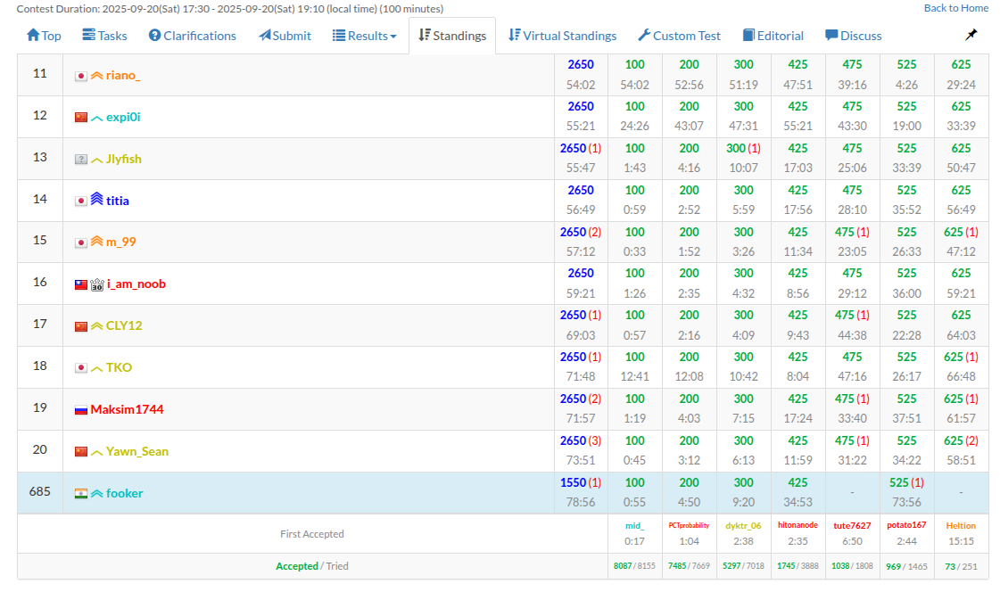
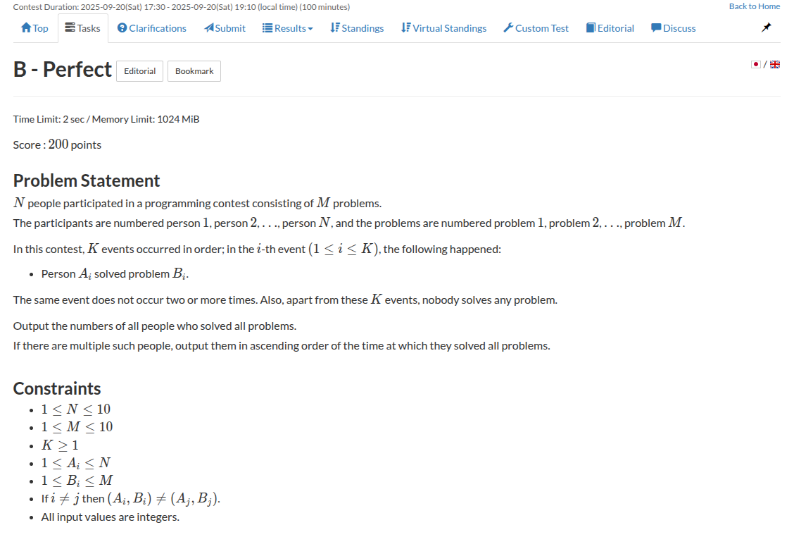
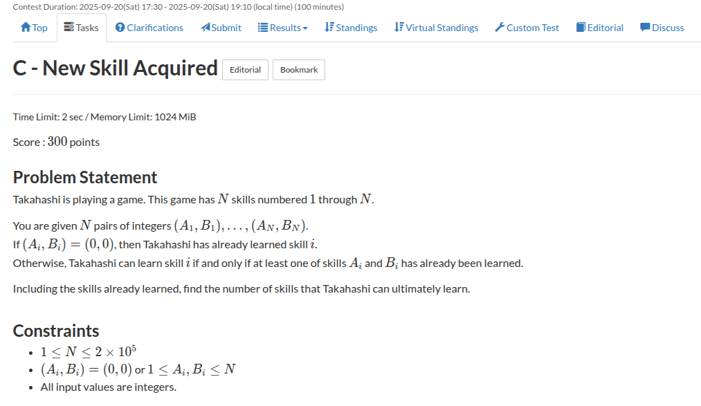
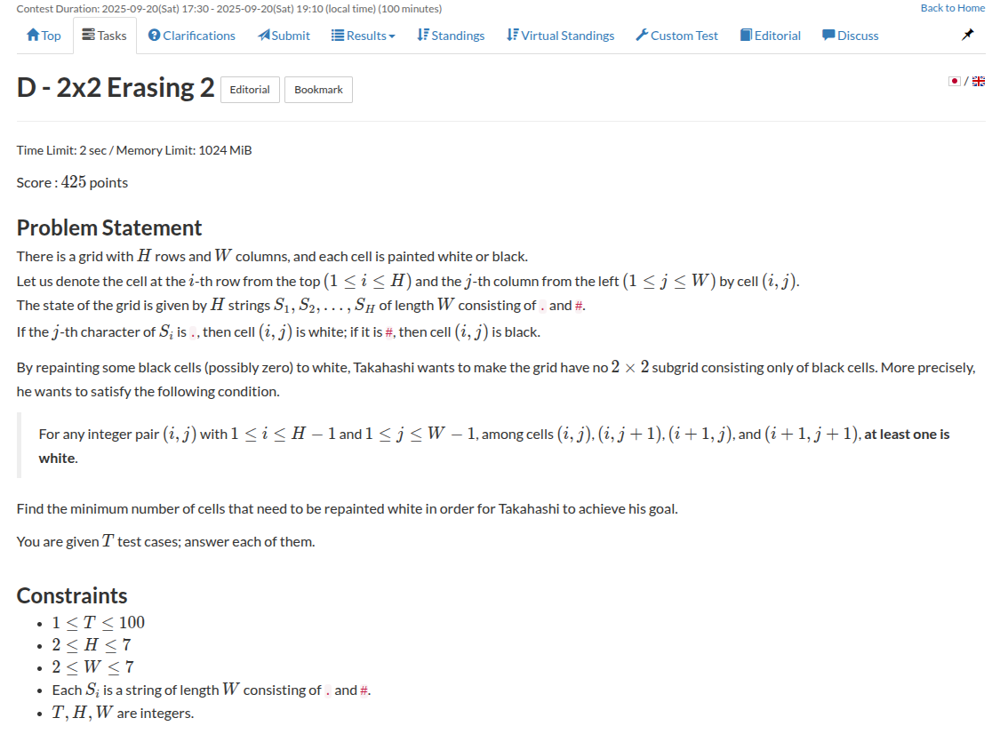
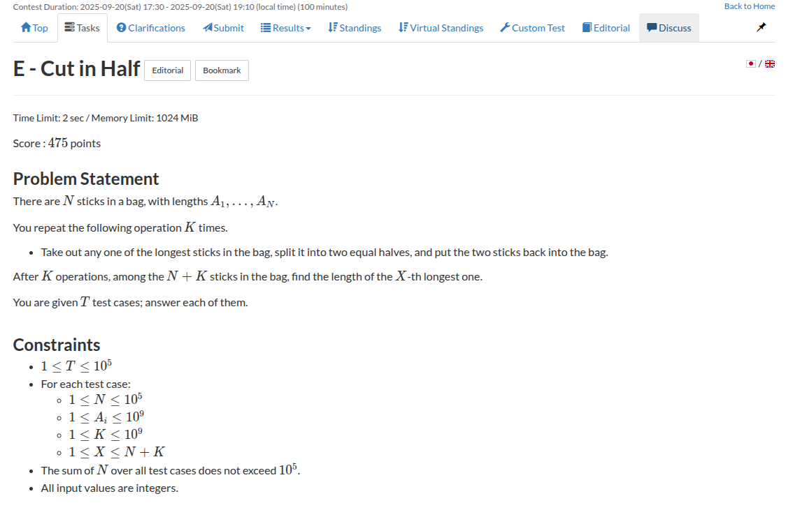
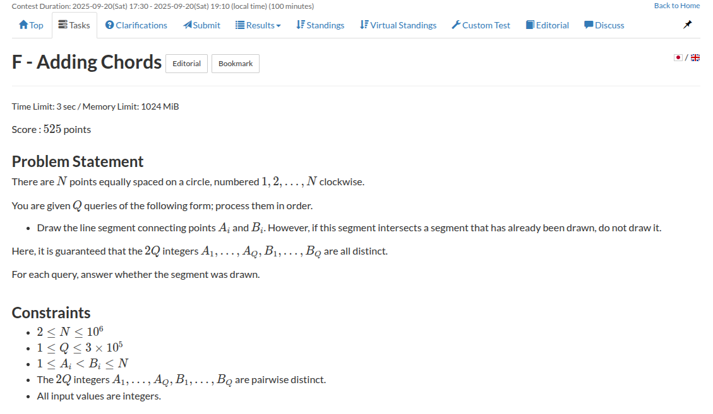

I participated in <a href="https://atcoder.jp/contests/abc424">AtCoder Beginner Contest 424</a> today and I managed to solve $5$ problems out of $7$. I think I missed out a really easy solve on problem $E$ and my solve for problem $D$ and problem $F$ is complicated too. I'll spend some time upsolving the last four problems on the contest.

|  | 
|:--:| 
| *Performance* |

## My Submissions 


I'm going to first discuss my thought process on these problems. Then I'll do the upsolving

### Problem A


this was pretty simple, I could guess what had to be done from the problem title itself. just check if any two sides are equal or nah.

{}
```c++
void solve() {
    int a,b , c;
    std::cin >> a >> b >> c;

    if (a == b || b == c || c == a) {
        std::cout << "Yes\n";
    } else {
        std::cout << "No\n";
    }
}
```
{}

Submission Link: https://atcoder.jp/contests/abc424/submissions/69454643

### Problem B



it took me a minute to figure out what data structure should I use to compute the answer until I looked at the constraints and just used old-school arrays lmao.

{}
```c++
void solve() {
    int n, m, k;
    std::cin >> n >> m >> k;

    int A[n + 1][m + 1];
    for (int i = 0; i <= n; i++) {
        for (int j = 0; j <= m; j++) {
            A[i][j] = 0;
        }
    }

    std::vector<int> ans;
    bool vis[n + 1];
    for (int i = 0; i <= n; i++) vis[i] = false;

    for (int i = 1, a, b; i <= k; i++) {
        std::cin >> a >> b;
        A[a][b] = 1;

        bool all = true;
        for (int j = 1; j <= m; j++) {
            if (A[a][j] == 0) all = false;
        }

        if (all and vis[a] == false) {
            vis[a] = true;
            ans.push_back(a);
        }
    }

    for (auto u: ans) {
        std::cout << u << ' ';
    }
}
```
{}

I had initially understood the problem incorrectly and I computed the answer offline and I was going to output the list of candidates in a sorted order. Until I looked at one of the testcases and realised that I actually had to compute it on the fly, then I moved the check logic inside the loop and created a visited array to prevent double checking and stored the answer online in a vector.

Submission Link: https://atcoder.jp/contests/abc424/submissions/69461876

### Problem C



I think this took me a bit more than what I should have required. I read the problem and realised that the premise is very suitable for a directed graph translation and immediately started writing the code. Still that took me 4 minutes.

Anyway, the idea is that you can create a directed graph and for every `(a, b)` at the `ith` skill you add the edges `a -> i` and `b -> i`. then you just have to traverse the graph from node `0` and count the number of visited nodes from `1` to `N`.

{}
```c++
void solve() {
    int n;
    std::cin >> n;

    std::vector<int> adj[n + 1];
    for (int i = 1, a, b; i <= n; i++) {
        std::cin >> a >> b;

        adj[a].push_back(i);
        adj[b].push_back(i);
    }

    int cnt = 0;
    std::vector<bool> vis(n + 1, false);

    std::queue<int> q;
    q.push(0);
    vis[0] = true;

    while (q.size()) {
        int s = q.front();
        q.pop();

        for (auto u: adj[s]) {
            if (vis[u]) continue;

            vis[u] = true;
            q.push(u);
        }
    }

    for (int i = 1; i <= n; i++) {
        if (vis[i]) cnt++;
    }

    std::cout << cnt << '\n';
}
```
{}

I'm really whining about writing out code fast but not that it really matters here lmfao. I should focus on AK'ing the contest first.

Submission Link: https://atcoder.jp/contests/abc424/submissions/69466847

### Problem D



I read the problem and thought that this might be a brute force with a greedy strategy like always choose the innermost corner of the 2x2 square and so on. But then I looked at the constraints and I had a gut feeling that my greedy strategies won't possibly work here. Infact, it's really easy to brute out all the possibilities using bitmask DP and I knew for the fact that such problems can be done using bitmask DP, so I started implementing that.

I suffered loss of focus twice or thrice in between where I would zap out of my mind and lose track of what I was doing. It had been a while since I did bitmask DP (probably like a year or so). I hadn't really implemented any bitmask DP ever since I resumed my competitive programming journey (in the past few weeks) so I was kinda rusty with the implementation, but I tried to structure it in a formal way.

First I would go ahead and initialise the dp states to -1 to indicate this state is not possible. Oh btw, the states are: `dp[i][j]` represents the minimum number of operations to get to the `ith` row with `j` as the number with bit representation on that row. so `dp[i][j]` is the minimum over `dp[i - 1][k]` where `j` and `k` do not share any `2x2` grid with all ones set. 

Next, you want to compute the answer for the first layer. So I had to write a helper function that would compute the number of operations to be performed on the row for it to look like the final number passed. This function looks kinda messy, I didn't really do a good job writing it and definitely didn't write it out correctly the first time. My solution failed on the sample testcases and I had to debug my code and I found out that this function was incorrect. Here's the snippet from the working code

```c++
int reachable(std::string s, int num) {
    bool ans = true;
    ll n = s.length();
    ll cnt = 0;
    for (ll i = 0; i < n; i++) {
        if (s[n - i - 1] == '.') {
            if ((num >> i) & 1) {
                ans = false;
            }
        } else {
            if (!((num >> i) & 1)) {
                cnt++;
            }
        }
    }

    if (!ans) {
        return -1;
    }

    return cnt;
}
```

Next, we want to start iterating over each row (first state) and the number possible on the `ith` row (second state). We first check if this number is possible from the initial number on the `ith` row. If possible, we add the number of operations required and then add the minimum from the previous layers such that there is no `2x2` grid.

I implemented this function to check compatibility of two numbers
```c++
bool okay(ll j, ll k, ll w) {
    bool okay = true;
    for (ll i = 0; i < w - 1; i++) {
        if (((j >> i) & 1)  and ((j >> (i + 1)) & 1) and ((k >> i) & 1) and ((k >> (i + 1)) & 1)) okay = false;
    }
    return okay;
}
```

Finally, you just have to iterate over the states of the last row and calculate the minimum over the states.

{}
```c++
int reachable(std::string s, int num) {
    bool ans = true;
    ll n = s.length();
    ll cnt = 0;
    for (ll i = 0; i < n; i++) {
        if (s[n - i - 1] == '.') {
            if ((num >> i) & 1) {
                ans = false;
            } else {

            }
        } else {
            if ((num >> i) & 1) {
                
            } else {
                cnt++;
            }
        }
    }

    if (!ans) {
        return -1;
    }

    return cnt;
}

bool okay(ll j, ll k, ll w) {
    bool okay = true;
    for (ll i = 0; i < w - 1; i++) {
        if (((j >> i) & 1)  and ((j >> (i + 1)) & 1) and ((k >> i) & 1) and ((k >> (i + 1)) & 1)) okay = false;
    }
    return okay;
}

void solve() {
    ll h, w;
    std::cin >> h >> w;

    std::string s[h + 1];
    for (ll i = 1; i <= h; i++) {
        std::cin >> s[i];
    }

    ll cont = (1LL << w);

    ll dp[h + 1][cont];
    for (ll i = 0; i <= h; i++) {
        for (ll j = 0; j < cont; j++) {
            dp[i][j] = -1;
        }
    }

    ll num[h + 1];
    for (ll i = 1; i <= h; i++) {
        ll compute = 0;
        ll cnt = 1;
        for (ll j = w - 1; j >= 0; j--) {
            compute += (s[i][j] == '#') * cnt;
            cnt *= 2;
        }
        num[i] = compute;
    }

    dp[1][num[1]] = 0;

    for (ll j = 0; j < cont; j++) {
        dp[1][j] = reachable(s[1], j);
    }

    for (ll i = 2; i <= h; i++) {
        for (ll j = 0; j < cont; j++) {
            ll resp = reachable(s[i], j);
            if (resp != -1) {
                dp[i][j] = resp;
                ll cnt = LLONG_MAX;
                for (ll k = 0; k < cont; k++) {
                    if (dp[i - 1][k] != -1 && okay(j, k, w)) {
                        cnt = std::min(cnt, dp[i - 1][k]);
                    }
                }
                if (cnt != LLONG_MAX) {
                    dp[i][j] += cnt;
                }
            }
        }
    }

    ll final_ = LLONG_MAX;
    for (ll j = 0; j < cont; j++) {
        if (dp[h][j] != -1) {
            final_ = std::min(final_, dp[h][j]);
        }
    }
    std::cout << final_ << '\n';
} 
```
{}

I still feel there are redundant parts in the above code. For example, the `num` calculation. I compute the numbers for the all the rows but only use it in the first row. 

Submission Link: https://atcoder.jp/contests/abc424/submissions/69481679

### Problem E



I had absolutely no clue how to start with this problem. I spent about 20 to 25 minutes and I could feel this has to be binary search, but I wasn't sure exactly how. They ask for the $X$th longest stick, but how do you find the $X$th longest one. If they had asked for the longest one, this was direct binary search on answer. You compute the number of operations required for the longest stick to be $D$ and then binary search. But idk how to find the $X$th longest stick.

I spent like a lot of time thinking about this one but I had no insights what-so-ever. I decided to check out the next problem since my rank was dropping on the standings.

### Problem F



This felt easy at the first glance. I thought maybe it must be tricky since are adding chords on a circle (and that might contribute to edge cases). Then I thought about it for a while, if I'm trying to add a chord let's say from `[L, R]` and if there is another chord that intersects it, then there can only be two ways of that happening, either there is another chord that overlaps the left endpoint or there is a chord that overlaps the rigth endpoint. That's it. So basically we are trying to add ranges that do not intersect on `[1, N]`. 

So how do we quickly check if a range intersects with previously added ranges? I thoughtt maybe we add $+1$ at $L$ and $-1$ at $R$ to denote that the range exists and then for another range `[L_2, R_2]`, if we want to check if it intersects or not, we just compute the subarray sum and if it is non-zero it intersects.

However, that is still problematic because what if the interval contains the right endpoint of another range and the left endpoint of yet another range. In this case, the interval intersects both the added ranges but the subarray sum is zero. 

Then, I thought if I randomise the weights of update, there is a very low chances of collision and that might actually work. So I used my iterative segment tree template and added updates generated using 

```c++
mt19937_64 rng(std::chrono::steady_clock::now().time_since_epoch().count());
ll random = uniform_int_distribution<ll>(0, 998244353 - 1)(rng);
```

and that worked!

{}
```c++
mt19937_64 rng(std::chrono::steady_clock::now().time_since_epoch().count());

void solve() {
    ll n, q;
    std::cin >> n >> q;

    ll ans[q + 1];
    for (ll i = 0; i <= q; i++) ans[i] = 0;

    ll tree[2 * n + 3];
    for (ll i = 1; i <= n; i++) tree[n + i - 1] = 0;
 
    for (ll i = n - 1; i > 0; i--) tree[i] = tree[i << 1] + tree[i << 1 | 1];
 
    auto query = [&] (ll l_, ll r_) -> ll {
        ll res = 0;
        for (l_ += n - 1, r_ += n - 1; l_ < r_; l_ >>= 1, r_ >>= 1){
            if (l_&1) res += tree[l_++];
            if (r_&1) res += tree[--r_];
        }
        return res;
    };
 
    auto update = [&] (ll ind, ll val) -> void {
        for (tree[ind += n - 1] += val; ind > 1; ind >>= 1) tree[ind >> 1] = tree[ind] + tree[ind ^ 1];
    };

    for (ll i = 1, a, b; i <= q; i++) {
        std::cin >> a >> b;
        if (query(a, b + 1) != 0) {
            ans[i] = 0;
        } else {
            ll random = uniform_int_distribution<ll>(0, 998244353 - 1)(rng);
            ans[i] = 1;
            update(a, random);
            update(b, -random);
        }
    }

    for (int i = 1; i <= q; i++) {
        if (ans[i]) {
            std::cout << "Yes\n";
        } else {
            std::cout << "No\n";
        }
    }
}
```
{}

Submission Link: https://atcoder.jp/contests/abc424/submissions/69496936

That actually saved my dying rank on the leaderboard, otherwise I was cooked.

## Upsolving ABC 424
### Problem E

Okay I read the solution, and wtf. This was just min heap. Basically, they use the fact that at any point of time, the number of distinct lengths of the stick are `O(N)` and the number of sticks for each distinct length grows exponentially, so we can just simulate this entirely.

```c++
void solve() {
    ll n, k, x;
    std::cin >> n >> k >> x;

    ll a[n + 1];
    for (ll i = 1; i <= n; i++) std::cin >> a[i];

    const ll D = 1LL << 30;
    std::map<ll, ll> mp;
    for (ll i = 1; i <= n; i++) {
        a[i] = a[i] * D;
        mp[-a[i]]++;
    }

    ll cnt = k;
    while (cnt) {
        auto [longest, count] = *mp.begin();
        if (count <= cnt) {
            cnt -= count;
            mp.erase(longest);
            mp[longest / 2] += count * 2;
        } else {
            mp[longest] -= cnt;
            mp[longest / 2] += cnt * 2;
            cnt = 0;
        }
    }

    ll rem = x, ans = -1;
    for (auto [length, count]: mp) {
        rem -= count;
        if (rem <= 0) {
            ans = -length;
            break;
        }
    }
    
    std::cout << std::fixed << std::setprecision(15) << (double)(ans) / D << '\n';
}   
```

Upsolved Submission Link: https://atcoder.jp/contests/abc424/submissions/69516992

### Problem G

I have some initial thoughts about this problem. Basically, at any moment the state of this problem depends on an array $A$ that stores the count of number of times any idol can perform in a song, an excitement accumulated and songs that are yet to be performed.

At every operation, we deduct a song, add it's excitement to the total accumulated excitement and reduce the count for some idols from the vector. Using these operations we intend to reach to an optimal state where possibly the vector is non-negative entirely, the accumulated excitement is maximised and the songs left is possibly zero or non-empty.

I have no clue what next. I read the editorial and it does make sense but I kinda cannot motivate it intuitively.
