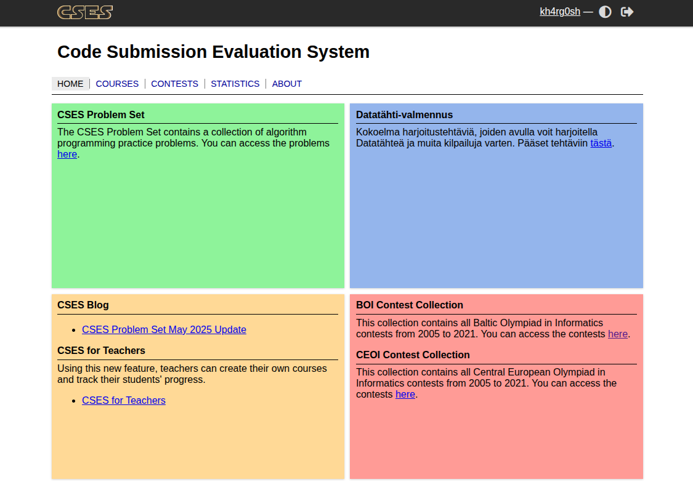

CSES is another online judge that has a great collection of popular competitive programming tasks. I had been doing CSES for the past 3 years until I took a break last year. Ever since, I feel like I'm quite rusty and I don't really remember much. So I've decided to start learning everything from scratch. I've made a new account on CSES (username: `kh4rg0sh`) and I'm going to solve and submit all the problems again. 

Problem Set Link: https://cses.fi/problemset/list/

## Introductory Problems
<table>

</table>

## Sorting and Searching
<table>
    <tr></tr>
</table>

## Dynamic Programming
<table>

</table>

## Graph Algorithms
<table>

</table>

## Range Queries
<table>

</table>

## Tree Algorithms
<table>

</table>

## Mathematics
<table>

</table>

## String Algorithms
<table>

</table>

## Geometry
<table>

</table>

## Advanced Techniques
<table>

</table>

## Sliding Window Problems
<table>

</table>

## Interactive Problems
<table>

</table>

## Bitwise Operations
<table>

</table>

## Construction Problems
<table>

</table>

## Advanced Graph Problems
<table>

</table>

## Counting Problems
<table>

</table>

## Additional Problems I
<table>

</table>

## Additional Problems II
<table>

</table>

