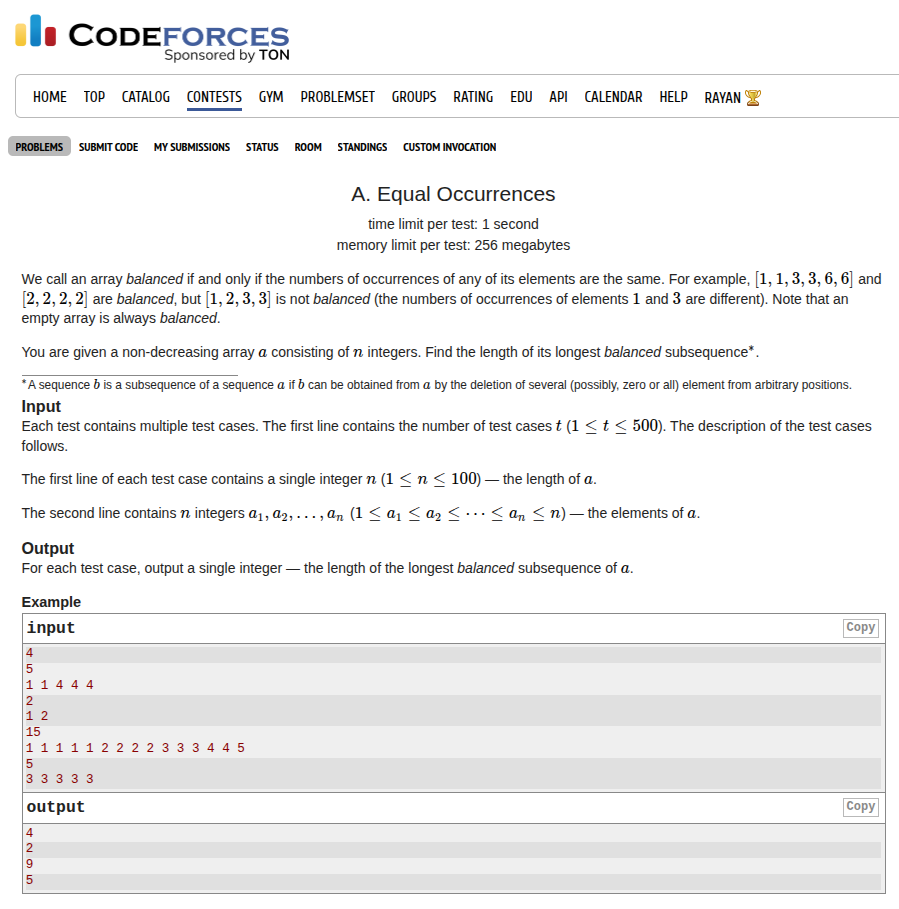

## Problem Statement <a href="https://codeforces.com/contest/2146/problem/A">[Link]</a>


## During Contest
I implemented the wrong approach at my first attempt. It was probably because I didn't think through the approach very well during my first read of the problem. 

Also, my typing was quite messed up too. I was making a lot of typos and my finger placements were not correct according to touch typing. I'm gonna try to force myself to code in the touch type finger positioning. 

As soon as I realised the correct approach, I used C-style arrays and made an edge case error that I solved by changing it to `std::vector` and using correct bounds for sorting.

## My Approach (the correct approach)
we call a subsequence balanced if the number of frequencies of all the elements in that subsequence is equal. suppose this frequency if `f`, then `f` is in the range `[min(f), max(f)]` over the array `A`. for each frequency `f`, we want to count the number of numbers we can have that can have this frequency and that would be the number of numbers with their frequency `>= f`. 

To implement this, we should store the frequencies of all the numbers in an array and sort this in descending order. then we just have to take the `max(i * freq[i])`.

### Implementation
I'm gonna implement the above idea straight
```c++
void solve() {
    ll n;
    std::cin >> n;

    std::vector<ll> a(n + 1);
    for (ll i = 1; i <= n; i++) {
        std::cin >> a[i];
    }

    std::vector<ll> freq(n + 1, 0);
    for (ll i = 1; i <= n; i++) {
        freq[a[i]]++;
    }

    std::sort(freq.begin() + 1, freq.begin() + n + 1, std::greater<ll>());
    ll ans = 0;
    for (ll i = 1; i <= n; i++) {
        ans = std::max(ans, i * freq[i]);
    }

    std::cout << ans << '\n';
}   
```

Submission Link: https://codeforces.com/contest/2146/submission/339792393

## After Thoughts
I think it is very clear what the approach is and there no scope for proofs or assumptions. If I find something interesting I'm gonna add it here.

