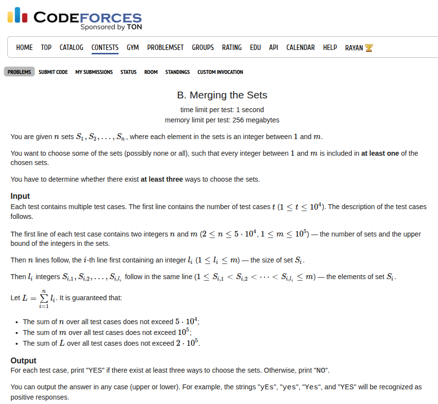

## Problem Statement <a href="https://codeforces.com/contest/2146/problem/B">[Link]</a>



## During Contest [Rant Alert!]
I think I'm ranting a lot but I feel, it's very important to put out the mistakes in the broad light.

As soon as I read this problem, I had no clue. No insights, no intuitions whatsoever. It felt like I'm dead stuck. I tried playing with the problem, toying with the representation in my head. Thinking about a graph equivalent, nothing worked. The next 30 minutes I just spent staring blank at my screen with no ideas or breakthroughs.

I picked up my pen and started scribbling on the paper and while scribbling and talking to myself, I accidentally stumbled upon an approach that might help me solve this lmfao.

## Thought Process
So this is the train of thoughts I went along. I drew two sets of `n` and `m` nodes and drew edges between the nodes if the number belonged to the set and I felt this might be something correlated to a graph or matching problem. But I was thinking too much and that would take me nowhere. Then I started thinking about what if I could just tell when it wasn't possible. It certainly isn't possible when there exists no parent for a number `i` and certainly not when all numbers `i` have exactly one parent. 

I tried plotting a binary representation of the `nxm` grid but that took me nowhere. I drew the number line from `1` to `m` and started thinking, what if I pick all the sets. I know that all the numbers would have parents (since the other cases are considered previously above). Now, what if we try to calculate the number of sets each number belongs to. Let's call this array `A`. maybe for some `i`, we have `A[i] = 1` or maybe for some we have `A[i] > 1`. but we will always have `A[i] >= 1`. Now what if i try to look at the parents of these numbers `A[i] = 1`. these guys have a single parent. If I try to exclude this set from my answer, I'm absolutely cooked, because then `i` won't have any parent. So, I cannot do that. So I must keep these intact. But keeping these means that I'm only allowed to mess with the sets not from this group. What if I look at the numbers in this set. All of the numbers in this disjoint set would have `A[i] >= 2` because otherwise it wouldn't belong to this set. it would belong to the previous set. so for this disjoint set, we have all the numbers in it having `A[i] >= 2`. Now what if the size of this set is `2`. wtf, we have our three answers right here! Holy shit, what if the size of the set if `1`, no we remove this and the numbers in there are cooked and there is no way this can be possible. so this cannot happen so we just have to check if the size of this set is atleast 2!

## My Approach
And within a few minutes of scribbling on the paper, I had my approach! To formalise, we will compute the frequencies of all the numbers. then for all those numbers that have frequency `= 1`, we will collect the parent set of those numbers and if the size of this set is `<= n - 2`, the answer is YES or else it's NO. ofcourse we need to account for the cases where there exists a number with no parent.

### Implementation
direct implementation of the above idea

```c++
void solve() {
    ll n, m;
    std::cin >> n >> m;

    std::vector<ll> freq(m + 1, 0);
    std::map<ll, std::vector<ll>> mp;
    for (ll i = 1, x; i <= n; i++) {
        std::cin >> x;

        for (ll j = 1, y; j <= x; j++) {
            std::cin >> y;
            freq[y]++;
            mp[y].push_back(i);
        }
    }

    bool exists = true;
    for (ll i = 1; i <= m; i++) {
        if (freq[i] == 0) {
            exists = false;
        }
    }

    if (exists) {
        std::cout << "NO\n";
    } else {
        std::set<ll> s;
        for (ll i = 1; i <= m; i++) {
            if (freq[i] == 1) {
                for (auto u: mp[i]) {
                    s.insert(u);
                }
            }
        }
        if (s.size() <= n - 2) {
            std::cout << "YES\n";
        } else {
            std::cout << "NO\n";
        }
    }
}   
```

Submission Link: https://codeforces.com/contest/2146/submission/339792190

## After Thoughts
I'm just a bit frowned on why it took me so long to build up this chain of logic and reach to the conclusion but I'm really happy I got to look within myself and read the entire thought process in my mind jotted down onto the paper. It felt like a real adventure. Each of the steps feel really logical to me and there's nothing really anything to prove here. Still it took me around 35-40 minutes after submitting problem A to submit problem B. I did get it correct in my first attempt so yay for the accuracy but I want to be faster than what I did. The main barrier is about building the logical chains in your mind. I'm gonna improve on that. Anyway, if I find anything interesting in this problem I'll add it below.


