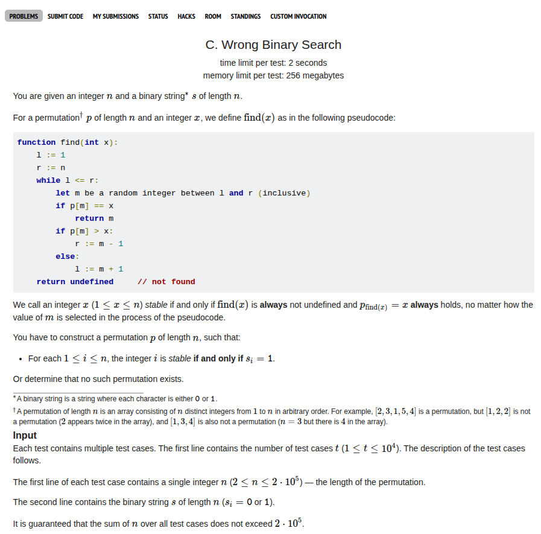

## Problem Statement <a href="https://codeforces.com/contest/2146/problem/C">[Link]</a>



## Thoughts
I feel like this was so much easier to think than problem B. personally my logic chain built really quick for this problem. I was able to solve this within 15 minutes, probably like code this in 5 and find the logic in 10 minutes. B >> C this was definitely misplaced.

## During Contest
during the contest, I felt so tricked by the problem statement. the first 5 minutes I had to settle down and understand what it meant and what was it asking for. 

From what I understood in simple words, if `i`th character is set, the number `i` in the permutation should be stable. Now what does stable mean, well in any case if it had to be stable then there should be no number smaller than `i` to the right of `i` or greater than `i` to the left of `i` otherwise binary search would be cooked for it. therefore that means if `i` is stable it correctly partitions the array into two subarray rearrangements.

so basically all set points are the pivots and the numbers in between these should be shuffled. Now the only time when the numbers in between cannot be shuffled is when their length is `1` and they are basically forced to be stable, when the problem actually asked it to be unstable. that's it.

this is what it was. this was so fucking easy and stupidly simple.

## Approach
we are gonna use the two pointers trick to keep track of the intervals with `0` which have to be reversed and for `1` you just spit out the correct index. if the interval of `0` is of length `1` then you print "NO"

### Implementation
Straightforward implementation of the above idea:
```c++
void solve() {
    ll n;
    std::cin >> n;

    std::string s;
    std::cin >> s;

    ll cnt = 0;
    ll l = 0;
    bool exists = true;
    for (ll i = 0; i < n; i++) {
        if (s[i] == '1') {
            if (cnt == 1) exists = false;
            cnt = 0;
        } else {
            cnt++;
        }
    }
    if (cnt == 1) exists = false;

    if (exists) {   
        std::cout << "YES\n";
        ll l = -1, r = -1;
        for (ll i = 1; i <= n; i++) {
            if (s[i - 1] == '1') {
                if (l != -1) {
                    r = i - 1;
                    for (ll j = r; j >= l; j--) {
                        std::cout << j << ' ';
                    }
                    l = -1;
                    r = -1;
                }
                std::cout << i << ' ';
            } else {
                if (l == -1) l = i;
            }
        }

        if (l != -1) {
            r = n;
            for (ll j = r; j >= l; j--) {
                std::cout << j << ' ';
            }
        }

        std::cout << '\n';
    } else {
        std::cout << "NO\n";
    }
}  
```

Submission Link: https://codeforces.com/contest/2146/submission/339794831

## After Thoughts
I feel like I really don't have much to talk about this problem. This is very straightforward and all the steps in my deduction logic feel very natural to me. I liked this problem. I'll add anything I find interesting down here.
