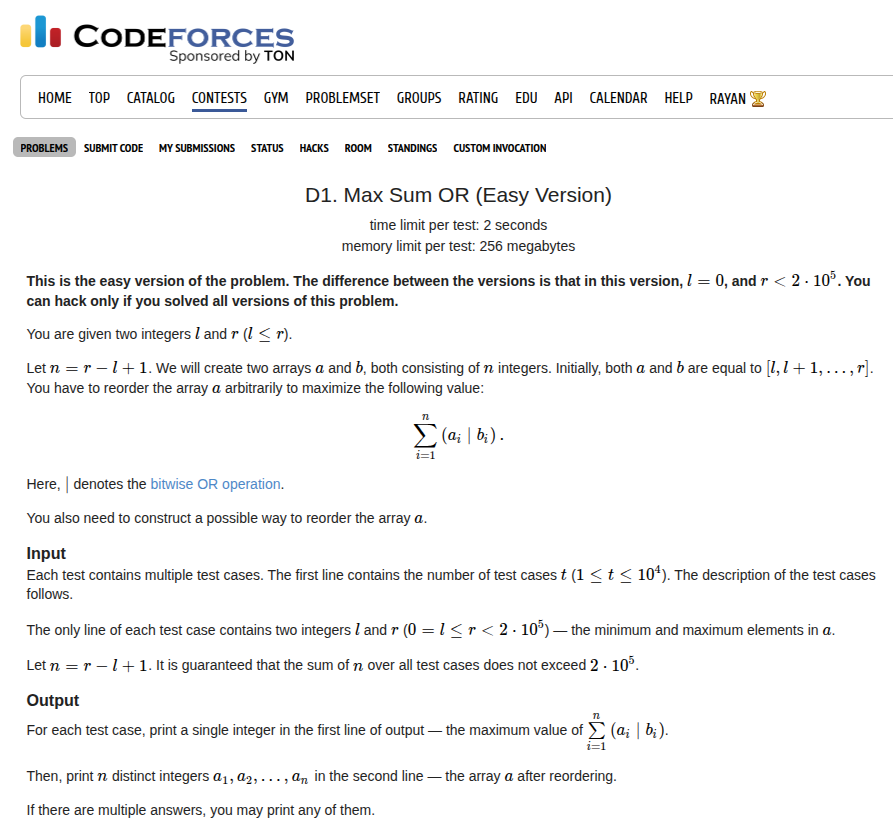

## Problem Statement <a href="https://codeforces.com/contest/2146/problem/D1">[Link]</a>



## Where the fun starts [Greedy Approach]
I feel like I might be missing out on some really nice observations and solutions but this is my attempt at this problem.

I started off with clearly playing around with the tests. It was clear that if `r` is the one below a power of two, just reverse everything. What if it isn't I initially conjectured an incorrect pattern, but then I realised that all the extra top shelf numbers would bring an extra highest set bit which we would greedily want to distribute to maximum numbers as possible. If we chop off this highest bit, we would actually want to pair it symmetrically around the highest power of 2, the remaining answer would be calculated recursively.

I don't know how to prove that this pattern works but it felt intuitively correct to me. It took me around 30 minutes to figure out that such a recusion would probably work and then the next 20 minutes to implement it out. I don't really like my implementation at all and I read the post contest discussion and there are really really nice and creative solutions out there for this problem. I'll try to motivate these solutions for the next 4 problems

## Bad Recursion Solution [based on Greedy + Pattern]

{}
```c++
ll recur(ll r) {
    if (r == 0) {
        return 0;
    }
    if (r == 1) {
        return 2;
    }

    ll cnt = 1, indx = 0;
    while (r + 1 >= cnt * 2) {
        cnt *= 2;
        indx++;
    }

    if (cnt == r + 1) {
        return r * (r + 1);
    }

    return (cnt * (cnt - 1) + 2 * (r - cnt + 1) * (1LL << indx)) + recur(r - cnt);
}

void get_seq(ll r) {
    if (r == 0) {
        std::cout << 0 << ' ';
        return;
    }

    if (r == 1) {
        std::cout << 1 << ' ' << 0 << ' ';
        return;
    }

    ll cnt = 1, indx = 0;
    while (r + 1 >= cnt * 2) {
        cnt *= 2;
        indx++;
    }

    if (cnt == r + 1) {
        for (ll i = cnt - 1; i >= 0; i--) {
            std::cout << i << ' ';
        }
        return;
    }

    get_seq(2 * cnt - r - 2);
    for (ll i = r; i > 2 * cnt - r - 2; i--) {
        std::cout << i << ' ';
    }

    return;
}

void solve() {
    ll l, r;
    std::cin >> l >> r;

    ll ans = recur(r);

    std::cout << ans << '\n';
    
    get_seq(r);
    std::cout << '\n';
}   
```
{}

it's not even really clear what i'm trying to do here. but the idea is really what  ive discussed above. reverse symmetrically around the highest power of 2 and compute the answer recursively for the prefix.

## Solution [Using Trie]

this is the most creative and beautiful solution for this problem. with this idea, you can even do D2 directly. there's no such requirement for writing recursive greedy ugly pattern based solutions like above.

{}
```c++
struct Node {
    struct Node *left, *right;
    i64 count;

    Node(): left(nullptr), right(nullptr), count(0) {}
    Node(int x): left(nullptr), right(nullptr), count(x) {}
};

class Trie {
    // creates a trie on b bits (pass b here)
private: 
    i64 b;
    struct Node* root;
public:
    Trie(i64 b): b(b), root(new struct Node()) {}

    // add the number val to the trie
    void add_node(i64 val) {
        struct Node* ptr = root;
        for (int i = b - 1; i >= 0; i--) {
            if ((val >> i) & 1) {
                if (ptr != nullptr && ptr->right == nullptr) {
                    ptr->right = new struct Node();
                }
                ptr = ptr->right;
                ptr->count++;
            } else {
                if (ptr != nullptr && ptr->left == nullptr) {
                    ptr->left = new struct Node();
                }
                ptr = ptr->left;
                ptr->count++;
            }
        }
    }

    // check if the number val exists
    bool exists_node(i64 val) {
        struct Node* ptr = root;
        for (int i = b - 1; i >= 0; i--) {
            if ((val >> i) & 1) {
                ptr = ptr->right;
            } else {
                ptr = ptr->left;
            }
            
            if (ptr == nullptr || ptr->count == 0) return false;
        }
        return true;
    }

    // delete the number from the trie
    bool delete_node(i64 val) {
        struct Node* ptr = root;
        for (int i = b - 1; i >= 0; i--) {
            if ((val >> i) & 1) {
                ptr = ptr->right;
            } else {
                ptr = ptr->left;
            }
            if (ptr == nullptr) return false;
            ptr->count--;
        }
        return true;
    }

    // find the number by max OR
    i64 find_max_or(i64 val) {
        struct Node* ptr = root;
        i64 value = 0;
        for (int i = b - 1; i >= 0; i--) {
            if ((val >> i) & 1) {
                if (ptr->left != nullptr && ptr->left->count) {
                    ptr = ptr->left;
                } else {
                    ptr = ptr->right;
                    value += (1LL << i);
                }
            } else {
                if (ptr->right != nullptr && ptr->right->count) {
                    ptr = ptr->right;
                    value += (1LL << i);
                } else {
                    ptr = ptr->left;
                }
            }
            if (ptr == nullptr) {
                return -1;
            }
        }
        return value;
    }
};

void solve() {
    ll l, r;
    std::cin >> l >> r;
    Trie tree(30);

    for (ll i = l; i <= r; i++) {
        tree.add_node(i);
    }

    ll ans = 0;
    std::vector<ll> store;
    for (ll i = l; i <= r; i++) {
        ll compute = tree.find_max_or(i);
        if (compute == -1) {
            exit(-1);
        } else {
            ans += (compute | i);
            if (!tree.delete_node(compute)) {
                exit(-1);
            } 
            store.push_back(compute);
        }
    }

    std::cout << ans << '\n';
    for (auto u: reversed(store)) {
        std::cout << u << ' ';
    }
    std::cout << '\n';
}
```
{}