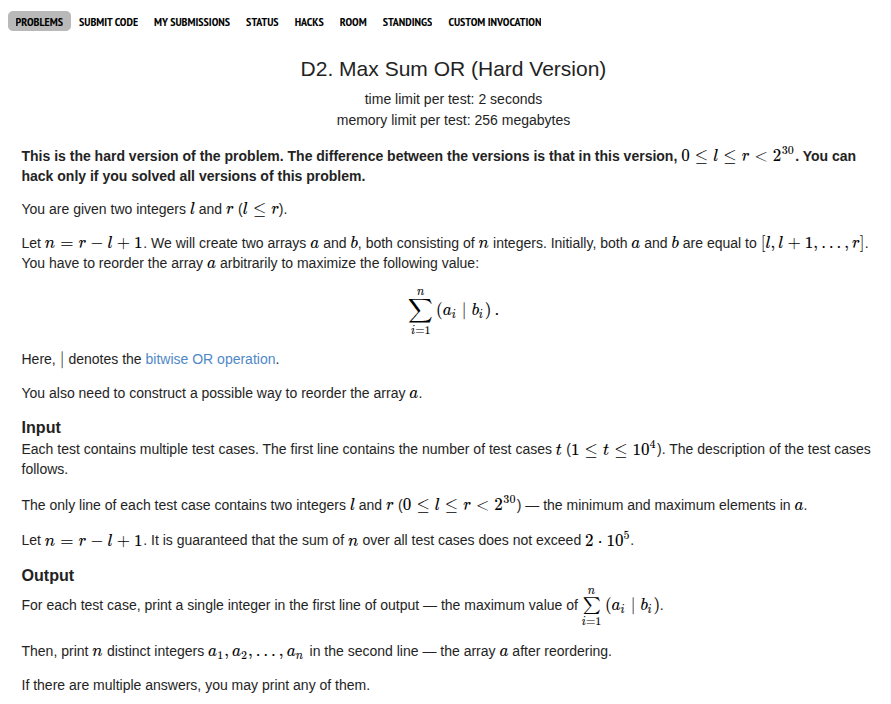
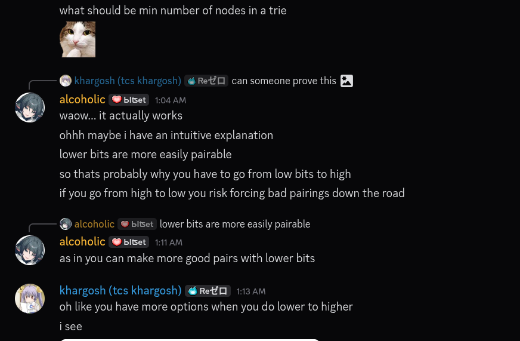

## Problem Statement <a href="https://codeforces.com/contest/2146/problem/D2">[Link]</a>



## Solution (Using Trie)
This solution works for both D1 and D2. the idea here is to add all the numbers in the range to a trie and then choose the number that greedily maximises the individual bitwise OR for each number using the trie.

for some reason, purning LSB to MSB seems to work for D2. MSB to LSB works for D1 but fails for D2. I wonder what's really going on here.

Update, an intuitive argument as to why LSB to MSB works


### Implementation
I implemented several versions of Trie to compare the performances of my implementation. The snippets can be found <a href="/competitive_programming/snippets/trie/">here</a>.

{}
```c++
struct Node {
    std::unique_ptr<Node> left, right;
    i64 count;

    Node(): left(nullptr), right(nullptr), count(0) {}
    Node(int x): left(nullptr), right(nullptr), count(x) {}
};

class Trie {
    // creates a trie on b bits (pass b here)
private: 
    i64 b;
    std::unique_ptr<Node> root;
public:
    Trie(i64 b): b(b), root(std::make_unique<Node>()) {}

    // add the number val to the trie
    void add_node(i64 val) {
        Node* ptr = root.get();
        for (int i = 0; i < b; i++) {
            if ((val >> i) & 1) {
                if (ptr->right == nullptr) {
                    ptr->right = std::make_unique<Node>();
                }
                ptr = ptr->right.get();
                ptr->count++;
            } else {
                if (ptr->left == nullptr) {
                    ptr->left = std::make_unique<Node>();
                }
                ptr = ptr->left.get();
                ptr->count++;
            }
        }
    }

    // check if the number val exists
    bool exists_node(i64 val) {
        Node* ptr = root.get();
        for (int i = 0; i < b; i++) {
            if ((val >> i) & 1) {
                if (ptr->right == nullptr) return false;
                ptr = ptr->right.get();
            } else {
                if (ptr->left == nullptr) return false;
                ptr = ptr->left.get();
            }
            if (ptr->count == 0) return false;
        }
        return true;
    }

    // delete the number from the trie
    bool delete_node(i64 val) {
        Node* ptr = root.get();
        for (int i = 0; i < b; i++) {
            if ((val >> i) & 1) {
                if (ptr->right == nullptr) return false;
                ptr = ptr->right.get();
            } else {
                if (ptr->left == nullptr) return false;
                ptr = ptr->left.get();
            }
            if (ptr->count <= 0) return false;
            ptr->count--;
        }
        return true;
    }

    // find the number by max OR
    i64 find_max_or(i64 val) {
        Node* ptr = root.get();
        i64 result = 0;
        for (int i = 0; i < b; i++) {
            if ((val >> i) & 1) {
                if (ptr->left != nullptr && ptr->left->count > 0) {
                    ptr = ptr->left.get();
                } else if (ptr->right != nullptr && ptr->right->count > 0) {
                    ptr = ptr->right.get();
                    result |= (1LL << i);
                } else {
                    return -1;
                }
            } else {
                if (ptr->right != nullptr && ptr->right->count > 0) {
                    ptr = ptr->right.get();
                    result |= (1LL << i);
                } else if (ptr->left != nullptr && ptr->left->count > 0) {
                    ptr = ptr->left.get();
                } else {
                    return -1;
                }
            }
        }
        return result;
    }
};

void solve() {
    ll l, r;
    std::cin >> l >> r;
    Trie tree(30);

    for (ll i = l; i <= r; i++) {
        tree.add_node(i);
    }

    ll ans = 0;
    std::vector<ll> store;
    for (ll i = r; i >= l; i--) {
        ll compute = tree.find_max_or(i);
        if (compute == -1) {
            exit(-1);
        } else {
            ans += (compute | i);
            if (!tree.delete_node(compute)) {
                exit(-1);
            } 
            store.push_back(compute);
        }
    }

    std::cout << ans << '\n';
    for (auto u: reversed(store)) {
        std::cout << u << ' ';
    }
    std::cout << '\n';
}
```
{}

{}
```c++
struct Node {
    struct Node *left, *right;
    i64 count;

    Node(): left(nullptr), right(nullptr), count(0) {}
    Node(int x): left(nullptr), right(nullptr), count(x) {}
};

class Trie {
    // creates a trie on b bits (pass b here)
private: 
    i64 b;
    struct Node* root;
public:
    Trie(i64 b): b(b), root(new struct Node()) {}

    // add the number val to the trie
    void add_node(i64 val) {
        struct Node* ptr = root;
        for (int i = 0; i < b; i++) {
            if ((val >> i) & 1) {
                if (ptr != nullptr && ptr->right == nullptr) {
                    ptr->right = new struct Node();
                }
                ptr = ptr->right;
                ptr->count++;
            } else {
                if (ptr != nullptr && ptr->left == nullptr) {
                    ptr->left = new struct Node();
                }
                ptr = ptr->left;
                ptr->count++;
            }
        }
    }

    // check if the number val exists
    bool exists_node(i64 val) {
        struct Node* ptr = root;
        for (int i = 0; i < b; i++) {
            if ((val >> i) & 1) {
                ptr = ptr->right;
            } else {
                ptr = ptr->left;
            }
            
            if (ptr == nullptr || ptr->count == 0) return false;
        }
        return true;
    }

    // delete the number from the trie
    bool delete_node(i64 val) {
        struct Node* ptr = root;
        for (int i = 0; i < b; i++) {
            if ((val >> i) & 1) {
                ptr = ptr->right;
            } else {
                ptr = ptr->left;
            }
            if (ptr == nullptr) return false;
            ptr->count--;
        }
        return true;
    }

    // find the number by max OR
    i64 find_max_or(i64 val) {
        struct Node* ptr = root;
        i64 value = 0;
        for (int i = 0; i < b; i++) {
            if ((val >> i) & 1) {
                if (ptr->left != nullptr && ptr->left->count) {
                    ptr = ptr->left;
                } else {
                    ptr = ptr->right;
                    value += (1LL << i);
                }
            } else {
                if (ptr->right != nullptr && ptr->right->count) {
                    ptr = ptr->right;
                    value += (1LL << i);
                } else {
                    ptr = ptr->left;
                }
            }
            if (ptr == nullptr) {
                return -1;
            }
        }
        return value;
    }
};

void solve() {
    ll l, r;
    std::cin >> l >> r;
    Trie tree(30);

    for (ll i = l; i <= r; i++) {
        tree.add_node(i);
    }

    ll ans = 0;
    std::vector<ll> store;
    for (ll i = r; i >= l; i--) {
        ll compute = tree.find_max_or(i);
        if (compute == -1) {
            exit(-1);
        } else {
            ans += (compute | i);
            if (!tree.delete_node(compute)) {
                exit(-1);
            } 
            store.push_back(compute);
        }
    }

    std::cout << ans << '\n';
    for (auto u: reversed(store)) {
        std::cout << u << ' ';
    }
    std::cout << '\n';
}
```
{}
