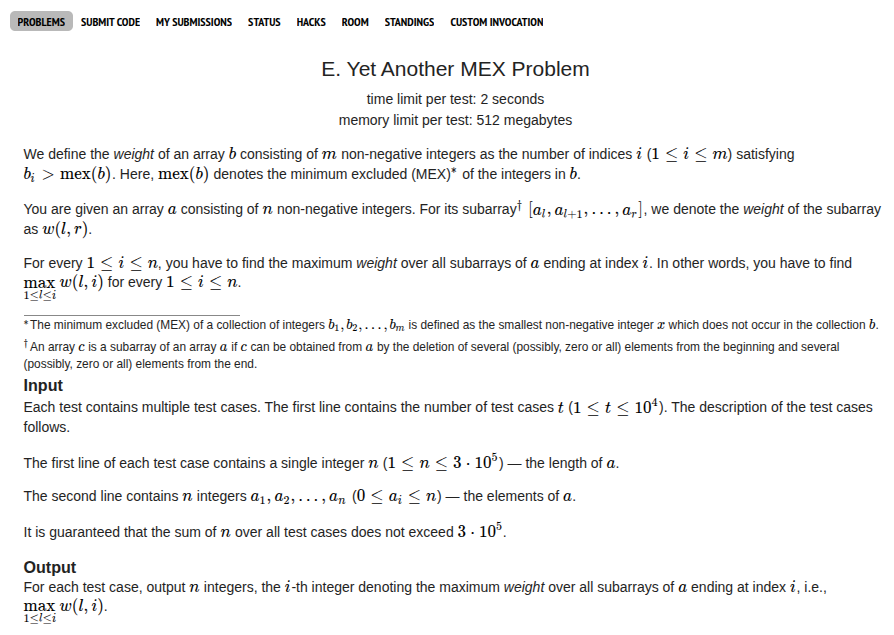

## Problem Statement <a href="https://codeforces.com/contest/2146/problem/E">[Link]</a>

## During the Contest
during the contest when I had submitted D1 and had a blank slate looking at problem D2, I thought I might wanna check out E. I read the problem and thought about it for a while. But I had no clue what to do here. I tried to make some observations related to MEX but that didn't work.

