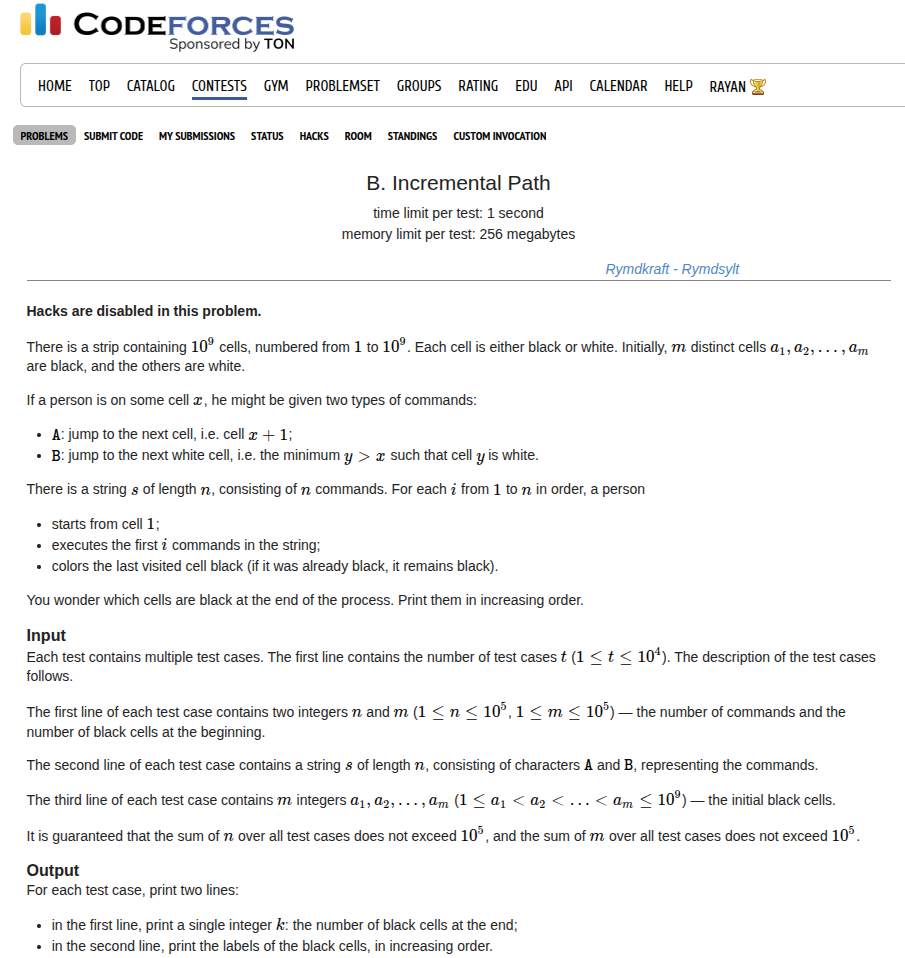

## Problem Statement <a href="https://codeforces.com/contest/2151/problem/B">[Link]</a>


## During the Contest
I was initially stunned because how would I compute the path taken for each index and it keeps updating? Or so did it seem to me. When I thought about this carefully, we are just changing the white cells to black cells. this might seem to create a problem for operation `B` but it doesn't watch what happens to position `pos` that is where we reach after completing `i` operations. we set `pos` to black. but if that happens when we performed operation `B` we just have to go to the next white cell which can be simulated. if the operation was `A` instead, then we don't have to do anything. we can just store the values in a set and print it.

This was a nice problem. I liked the observation here.

### Implementation
this is what I did in the contest
```c++
void solve() {
    ll n, m;
    std::cin >> n >> m;
 
    std::string s;
    std::cin >> s;
 
    std::vector<ll> a(m + 1, 0);
    for (ll i = 1; i <= m; i++) {
        std::cin >> a[i];
    }
 
    std::set<ll> black;
    for (ll i = 1; i <= m; i++) {
        black.insert(a[i]);
    }
 
    ll pos = 1;
    for (ll i = 0; i < n; i++) {
        if (s[i] == 'A') {
            pos += 1;
            black.insert(pos);
        } else {
            pos += 1;
            while (black.count(pos)) pos++;
            black.insert(pos);
            while (black.count(pos)) pos++;
        }
    }
 
    std::cout << black.size() << '\n';
    for (auto u: black) {
        std::cout << u << ' ';
    }
    std::cout << '\n';
}
```

Submission Link: https://codeforces.com/contest/2151/submission/340155604

## After Thoughts
It might be confusing to think why isn't `while (black.count(pos)) pos++;` not causing a TLE? that would never happend because the number of black cells will always be of the order `10^5` so we will always reach a white cell in reasonable time. And `pos` is monotonically increasing so that echoes the idea of two pointers.
