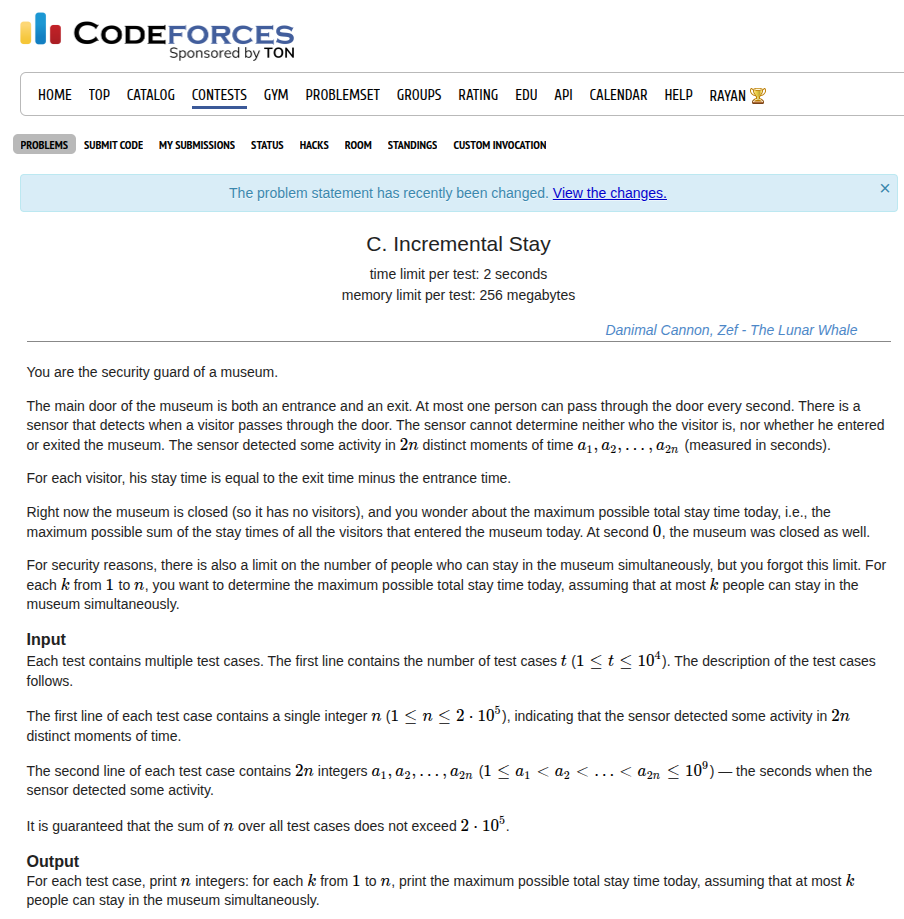

## Problem Statement <a href="https://codeforces.com/contest/2151/problem/C">[Link]</a>


## During Contest
This was again very straightforward to observe. My greedy idea was to make the ranges span the longest. It seemed to fix the ranges for `k - 1` of them and let the `k`th guy come and go. we symmetrically pair up the indices to maximise the length of the ranges and I couldn't find any counter-example to this greedy so I implemented this and it worked lmao.

### Implementation
the implementation is a slightly tricky, here's how I did it

```c++
void solve() {
    ll n;
    std::cin >> n;
 
    std::vector<ll> a(2 * n + 1, 0);
    for (ll i = 1; i <= 2 * n; i++) {
        std::cin >> a[i];
    }
 
    ll ans1 = 0;
    for (ll i = 1; i <= 2 * n; i += 2) {
        ans1 += (a[i + 1] - a[i]);
    }
    ll ans2 = 0;
    for (ll i = 2; i < 2 * n; i += 2) {
        ans2 += (a[i + 1] - a[i]);
    }
 
    ll actual = 0;
    for (ll i = 1; i <= n; i++) {
        if (i % 2) {
            std::cout << ans1 + actual << ' ';
            actual += a[2 * n + 1 - i] - a[i];
            ans1 -= (a[i + 1] - a[i]);
            ans1 -= (a[2 * n + 1 - i] - a[2 * n - i]);
        } else {
            std::cout << ans2 + actual << ' ';
            actual += a[2 * n + 1 - i] - a[i];
            ans2 -= (a[i + 1] - a[i]);
            ans2 -= (a[2 * n + 1 - i] - a[2 * n - i]);
        }
    }
    std::cout << '\n';
}
```

Submission Link: https://codeforces.com/contest/2151/submission/340162924
