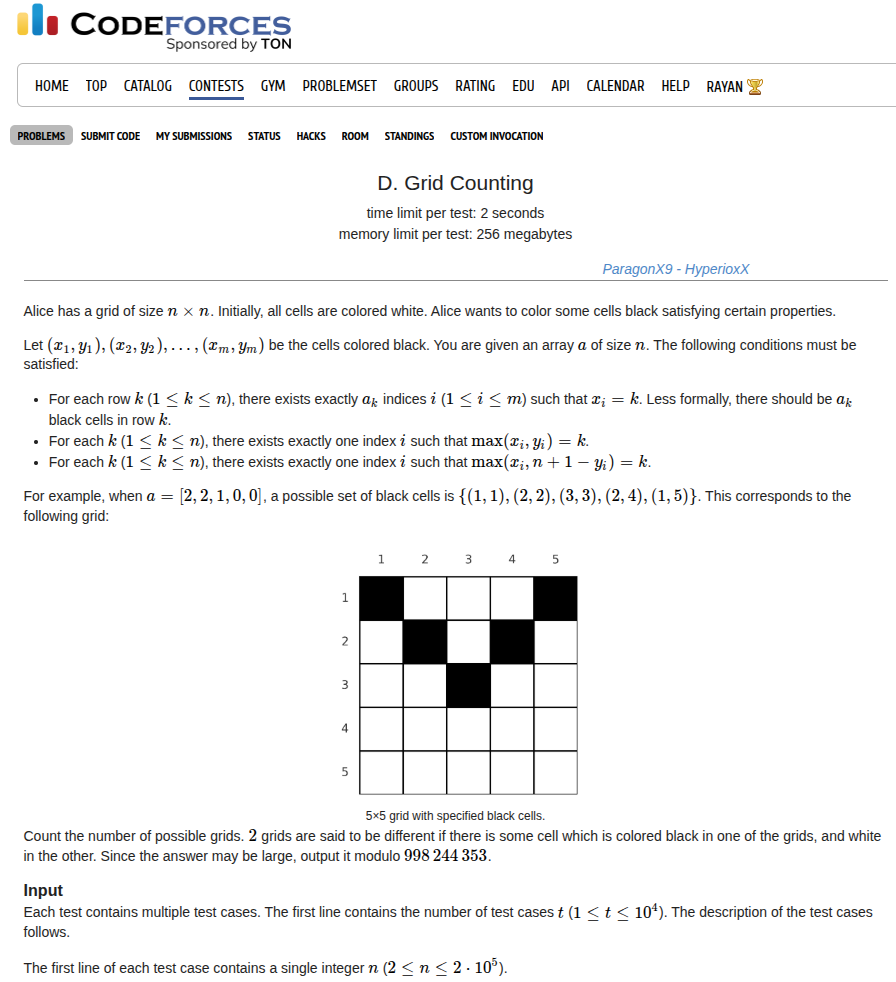
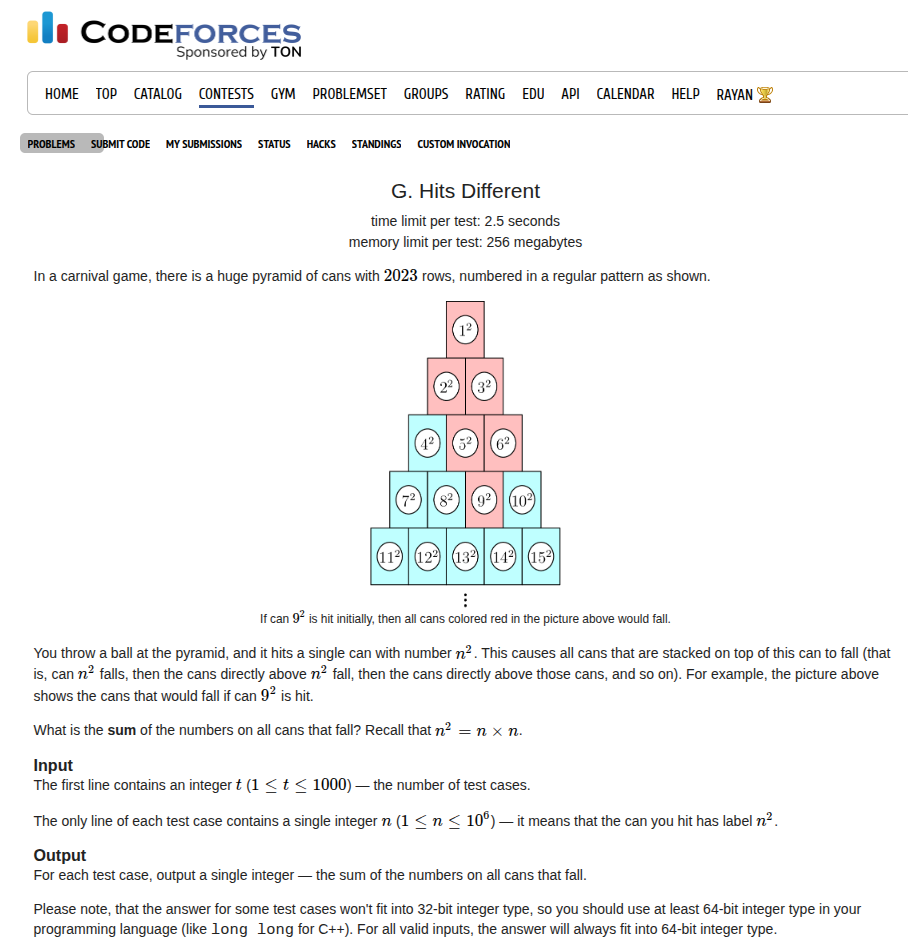
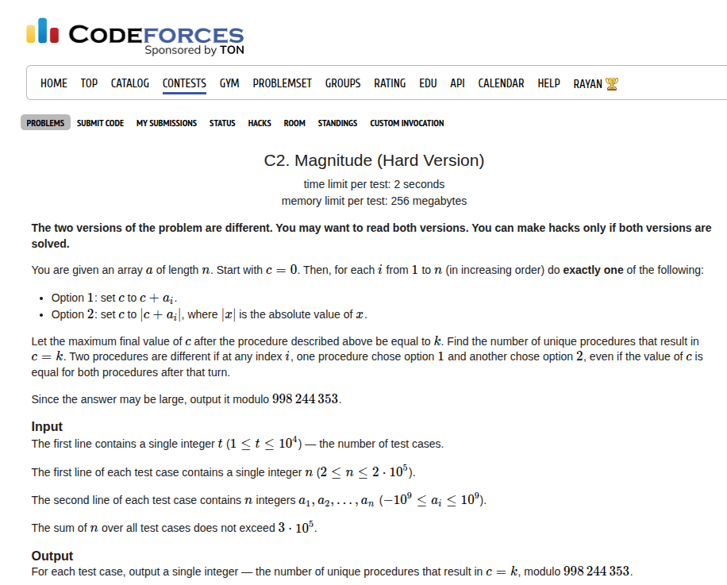
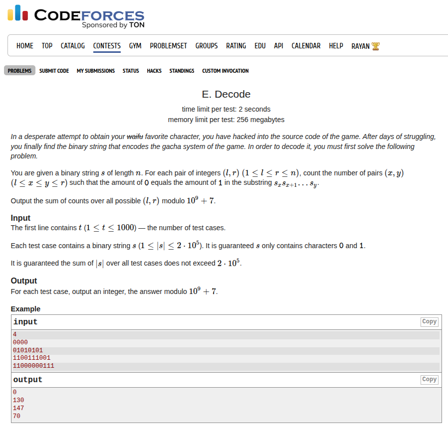
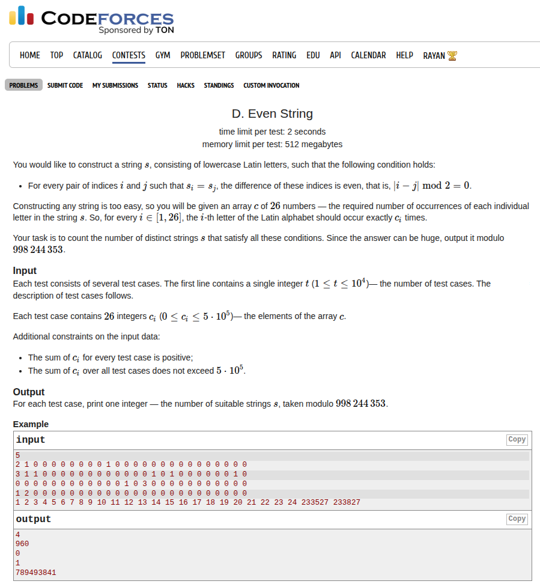

## Problem Statement <a href="https://codeforces.com/contest/2151/problem/D">[Link]</a>


## Some Context
At this point I was done with three problems clean within 25 to 30 minutes. I was like at around 20 to 30th rank on the Div. 2 leaderboard and I started panicking. I read problem D and my mind went complete blank. I had no idea what-so-ever on this problem. I tried to make observations but I wasn't able to make any reasonable progress. The bigger problem was I wasn't able to see how to even "count". What approach should I take to "count" the number of colorings on this grid. DP didn't seem like an option. I tried to think mathematically but the tiles just kept jumping in my mind idk why am I so autistic.

I feel like I should really go hard and practice as much combinatorics as I can. I need to develop my thinking I'm really lacking on these kinds of problems.

## Thought Process

I'll start listing the observations that I could make while doing this problem. 

The first thing I noticed was that if for each `k` from `1` to `n` we need to satisfy condition `2` and `3`, then we are forced to place two black tiles on the top left and top right corner. If we are forced to do that, this means we are forced to keep the entire last row, first column and last column completely white due to condition `2` and `3`.

this motivates us to think about what happens to second column. we need to make sure the boundaries of `2x2` square have atleast one black tile, but the first column is exempted, so the only choice we have is to place it in the first or the second row for the second column. but if we do that, the entire second last row is exempted. similarly we are forced to do this till we reach the middle row. this forces the lower half of the board to be entirely blank.

Now if you start thinking carefully, this actually means for each `i`th column we are only allowed to choose from the first `i` rows. Therefore for each `i`th row, the number of permissible choices for colouring are `n - 2*i + 2`. if we start coloring from the middle, we are going to end up choosing some cells that would be black listed for the above rows due to conditions `2` and `3`, therefore for each row the number of possibilities are `(n - 2*i + 2 - suff_sum[i+1]) choose a[i]`. so we just multiply these for the first half and get the answer.

### Implementation
This took me about 2 hours to think. I really wish I had moved along this thought process much faster and thought much cleaner. Anyway, here's my implementation

```c++
const ll TOTAL_NUM = 200001;
ll fact[TOTAL_NUM];
ll invfact[TOTAL_NUM];
 
void init() {
    fact[0] = 1;
    fact[1] = 1;
    for (ll i = 2; i < TOTAL_NUM; i++) {
        fact[i] = (i * fact[i - 1]) % MOD2;
    }
 
    invfact[0] = 1;
    invfact[1] = 1;
    invfact[TOTAL_NUM - 1] = binpow(fact[TOTAL_NUM - 1], MOD2 - 2, MOD2);
    for (ll i = TOTAL_NUM - 1; i > 1; i--) {
        invfact[i - 1] = (invfact[i] * i) % MOD2;
    }
}
 
void solve() {
    ll n;
    std::cin >> n;
 
    std::vector<ll> a(n + 1, 0);
    for (ll i = 1; i <= n; i++) {
        std::cin >> a[i];
    }
 
    ll sum = 0;
    for (ll i = 1; i <= n; i++) {
        sum += a[i];
    }
 
    if (sum != n) {
        std::cout << 0 << '\n';
        return;
    }
 
    for (ll i = 1 + (n + 1) / 2; i <= n; i++) {
        if (a[i] != 0) {
            std::cout << 0 << '\n';
            return;
        }
    }
 
    std::vector<ll> suff(n + 2, 0);
    for (ll i = n; i > 0; i--) {
        suff[i] = suff[i + 1] + a[i];
        if (i <= (n + 1) / 2) {
            if (suff[i] > n - 2 * i + 2) {
                std::cout << 0 << '\n';
                return;
            }
        }
    }
 
    ll ans = 1;
    for (ll i = 1; i <= (n + 1) / 2; i++) {
        if (a[i] > (n - 2 * i + 2 - suff[i + 1])) {
            std::cout << 0 << '\n';
            return;
        }
        
        ll cur = fact[n - 2 * i + 2 - suff[i + 1]];
        cur = (cur * invfact[a[i]]) % MOD2;
        cur = (cur * invfact[(n - 2 * i + 2 - suff[i + 1]) - a[i]]) % MOD2;
        ans = (ans * cur) % MOD2;
    }
 
    std::cout << ans << '\n';
}
```

We initially do a couple of checks to determine if it is impossible. These checks are the ones that we initially thought about. Then we compute the answer and if at all it is impossible to choose `a[i]` cells from the permissible number of cells, the answer again would be zero.

Submission Link: https://codeforces.com/contest/2151/submission/340202846

Man, I really need to get better at these kind of problems. I really brick such problems, these are really a stepping stone for becoming better. Idk what should I do. Should I start grinding down the problems list sorted by "Combinatorics"? 

Yea, let's do that. I'm gonna ask limak to generate random `1600-1700` rated combinatorics problem. Every 5 problems of the same rating that we solve without the help of the editorial, we level up the difficulty. If out of 5 we are not able to solve 3 or more than 3 on our own, difficulty too high, drop down a step.

# Combinatorics Grind
## 1. Hits Different [1600] <a href="https://codeforces.com/contest/1829/problem/G">[Link]</a>



I've seen this problem before. The idea is to notice that if we shift the triangular structure to a rectangle `2024x2024` then we can just precompute the prefix sum, and then just answer the prefix queries in `O(1)`. This was easy, there was nothing particularly "combinatorics" about this.

{}
```c++
 
const ll TOTAL_CNT = 2024;
ll val[TOTAL_CNT][TOTAL_CNT];
ll pref[TOTAL_CNT][TOTAL_CNT];
ll rows[TOTAL_CNT * TOTAL_CNT];
ll cols[TOTAL_CNT * TOTAL_CNT];
 
void solve() {
    
}
 
int main(){
    std::ios_base::sync_with_stdio(false);
    std::cin.tie(0);
 
    for (ll i = 0; i < TOTAL_CNT; i++) {
        pref[i][0] = 0;
        pref[0][i] = 0;
        val[i][0] = 0;
        val[0][i] = 0;
    }
 
    for (ll i = 1; i < TOTAL_CNT; i++) {
        for (ll j = 1; j < TOTAL_CNT; j++) {
            if (i == 1) {
                val[i][j] = ((j * (j + 1)) / 2);
                if (val[i][j] <= 1000 * 1000) {
                    rows[val[i][j]] = i;
                    cols[val[i][j]] = j;
                }
            } else {
                val[i][j] = val[i - 1][j] + (i + j - 2);
                if (val[i][j] <= 1000 * 1000) {
                    rows[val[i][j]] = i;
                    cols[val[i][j]] = j;
                }
            }
        }
    }
 
    for (ll i = 1; i < TOTAL_CNT; i++) {
        for (int j = 1; j < TOTAL_CNT; j++) {
            val[i][j] = val[i][j] * val[i][j];
        }
    }
 
    for (ll i = 0; i < TOTAL_CNT; i++) {
        pref[i][0] = 0;
        pref[0][i] = 0;
    }
 
    for (ll i = 1; i < TOTAL_CNT; i++) {
        for (int j = 1; j < TOTAL_CNT; j++) {
            pref[i][j] = val[i][j] + pref[i - 1][j] - pref[i - 1][j - 1] + pref[i][j - 1];
        }
    }
 
    int t = 1;
    std::cin >> t;
 
    // init();
    // init_sieve();
 
    while(t--) {
        // solve();
        ll n;
        std::cin >> n;
 
        ll r = rows[n];
        ll c = cols[n];
        std::cout << pref[r][c] << '\n';
    }
}
```
{}

Submission Link: https://codeforces.com/contest/1829/submission/340287914

## 2. Magnitude (Hard Version) [1700] <a href="https://codeforces.com/contest/1984/problem/C2">[Link]</a>



Could not solve this.

I spent a lot of time making observations on this one but it lead me nowhere. I observed that we just had to make absolute value operations on the prefix sums. then I tried thinking greedy approaches but I dont think any of them were right. 

The biggest issue I was encountering about this problem was how do I find that there are two different paths to actually reach the maximum. I think I finally was able to reach to a greedy algorithm that would give you the maximum value using a greedy path but I had no clue how do I find some other paths to the maximum answer. 

I then took a peek at the editorial and read the hints and it made sense lmao. The observation here is that you really only need to make second operation once, and that too on the minimum valued prefix sum. That's it. If you think about it, plot the prefix sum values, if you make the second operation on a positive prefix sum, it's wasted. If you make it on a negative but not minimum prefix sum, ofcourse it lifts up the value, but the maxima would shift up more when you apply it to the minimum valued prefix sum because you create the greatest maxima push upwards. Then if you think why do you only need to apply this operation once and not twice? what happens when you apply this to two places that are not the minimum valued prefix sum? Why would that not lead us to the maximum answer? If we don't apply it to minimum valued prefix sum, it will stay negative and that would leave scope for the last element to still get more loft. If we apply it to the minimum valued prefix sum and as well as to some other position (ofcourse negative valued prefix sum), and let's say this non minimum position occurs before than the global minima then if it makes the prefix minium positive we have lost the chance to get the maximum loft for the last element and this is definitely not the correct path. This hints us that it always correct to apply the operation 2 once on of the global minima (since there can be many) values.

{}
```c++
void solve() {
    ll n;
    std::cin >> n;
 
    std::vector<ll> a(n + 1, 0);
    for (ll i = 1; i <= n; i++) {
        std::cin >> a[i];
    }
 
    std::vector<ll> pref(n + 1, 0);
    ll m = LLONG_MAX;
    for (ll i = 1; i <= n; i++) {
        pref[i] = pref[i - 1] + a[i];
        m = std::min(m, pref[i]);
    }
 
    ll non_zero = 0;
    ll ans = 0;
    for (ll i = 1; i <= n; i++) {
        if (m >= 0) break;
        if (pref[i] != m) {
            if (pref[i] >= 0) {
                non_zero++;
            }
        } else {
            ans = ans + binpow(2, non_zero + (n - i), MOD2);
            ans %= MOD2; 
        }
    }
    if (m >= 0) {
        ans = binpow(2, n, MOD2);
    }
 
    std::cout << ans << '\n';
}
```
{}

Submission Link: https://codeforces.com/contest/1984/submission/340337689

## 3. Decode [1600] <a href="https://codeforces.com/contest/1996/problem/E">[Link]</a>



This was easy. It's clear that we just want to compute `x * (n - y + 1)` for each substring `(x, y)` that has equal counts. Now the count of these substrings can shoot to `O(N^2)`, this is where you need your prefix sums tricks. If we assign `-1` to all `0` characters and `+1` to all `1` characters then we are just looking for the zero sum subarrays. it's a well known trick to count the number of zero sum subarrays by fixing the right endpoint and computing the number of subarrays with the same prefix sum using a map. but in this case, what if we just stored the sum of indices for each prefix sum. that is `mp[pref[i]] += i + 1`. then if we check for `pref[j]` in the map, we just need to add `(n - j + 1) * mp[pref[j]]` to the answer for every index `j` and that works.

this was very clean. phew.

{}
```c++
void solve() {
    std::string s;
    std::cin >> s;
 
    ll n = s.length();
 
    std::vector<ll> a(n + 1, 0);
    for (ll i = 1; i <= n; i++) {
        if (s[i - 1] == '0') a[i] = -1;
        else a[i] = 1;
    }
 
    std::map<ll, ll> mp;
    mp[0] = 1;
    ll ans = 0;
    ll pref = 0;
    for (ll i = 1; i <= n; i++) {
        pref += a[i];
        ans += (n - i + 1) * mp[pref];
        ans %= MOD1;
        mp[pref] += (i + 1); 
    }
    
    std::cout << ans << '\n';
}
```
{}

Submission Link: https://codeforces.com/contest/1996/submission/340340935


## 4. Even String [1700] <a href="https://codeforces.com/contest/2086/problem/D">[Link]</a>



I have some initial thoughts about this. If `n` is the sum of all the numbers in that array, then we just have to split all `26` characters into group of two, one for the odd indices and one for the even. Then for the odd we do `n` choose `o1, o2, o3, ...` and for the even we do `n` choose `e1, e2, e3, ...` and then multiply the result but we do this for all possible splitting of the characters into such two groups such that the splitting is distinct and for each splitting to be valid we need to make sure that it completely fills the array without any leaking or loss. This is a very difficult obstruction in my logical thinking barrier because both of these things are extremely non-trivial, how do we get past this.

