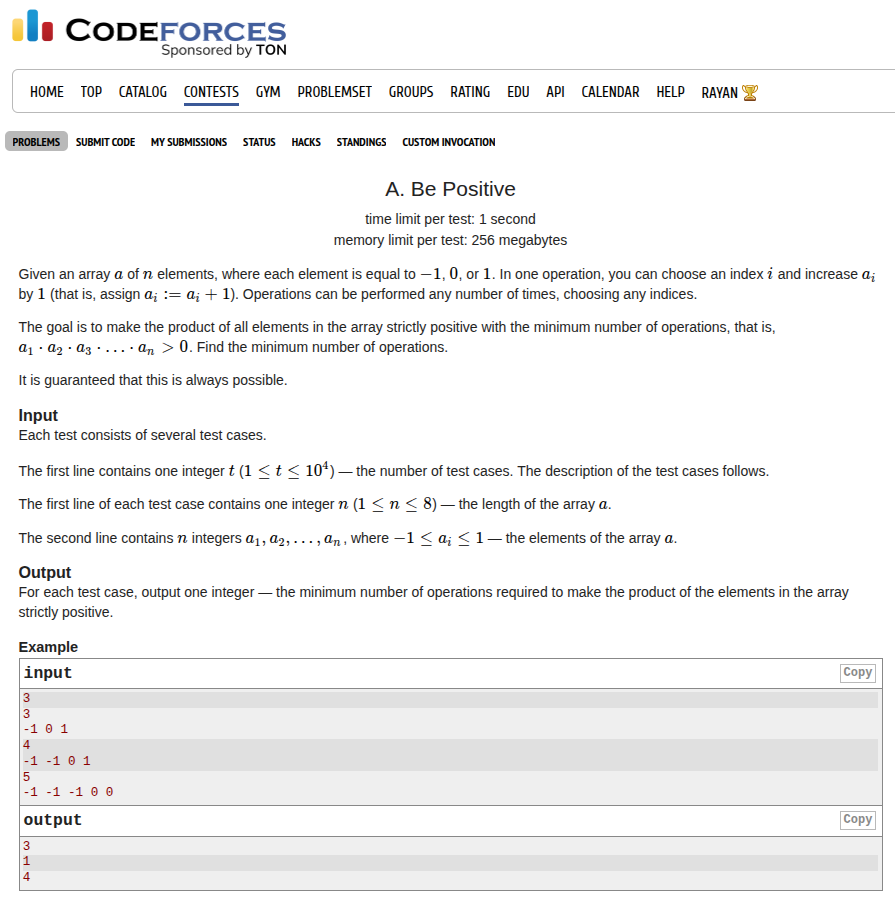

## Problem Statement <a href="https://codeforces.com/contest/2149/problem/A">[Link]</a>



## During Contest
This is easy, you just have to calculate the number of zeroes. These will contribute a one each. Then compute the parity of the number of `-1`. if this is even, do nothing or else if this is odd then add `2`.

### Implementation
```c++
void solve() {
    ll n;
    std::cin >> n;
 
    std::vector<ll> a(n + 1, 0);
    ll ans = 0, cnt = 0;
    for (ll i = 1; i <= n; i++) {
        std::cin >> a[i];
        if (a[i] == 0) ans++;
        else if (a[i] == -1) cnt++;
    }
 
    std::cout << ans + (cnt % 2) * 2 << '\n';
}
```

Submission Link: https://codeforces.com/contest/2149/submission/340371689
