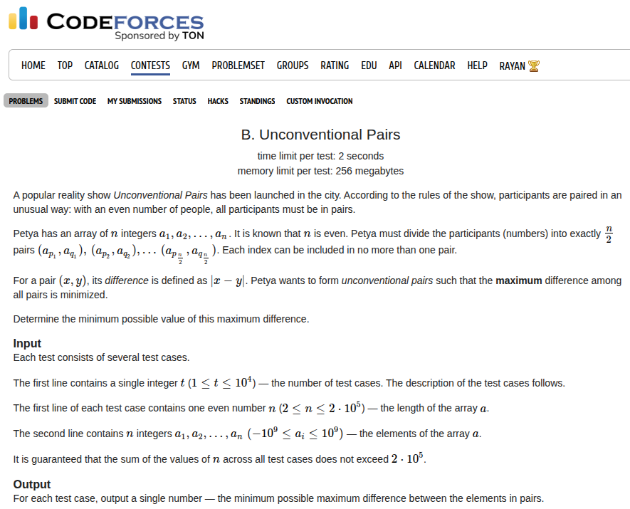

## Problem Statement <a href="https://codeforces.com/contest/2149/problem/B">[Link]</a>


## During Contest
This is similar to the USACO silver problem <a href="https://usaco.org/index.php?page=viewproblem2&cpid=738">Paired Up</a>. The idea is we sort and pair adjacent indices and that should guarantee minimising the maximum difference (this can be proved with exchange arguments that doing such pairing yields the optimal solution).

### Implementation
```c++
void solve() {
    ll n;
    std::cin >> n;
 
    std::vector<ll> a(n + 1, 0);
    for (ll i = 1; i <= n; i++) {
        std::cin >> a[i];
    }
 
    std::sort(begin(a) + 1, begin(a) + n + 1);
    ll ans = 0;
    for (ll i = 1; i <= n; i += 2) {
        ans = std::max(ans, a[i + 1] - a[i]);
    }
 
    std::cout << ans << '\n';
}
```

Submission Link: https://codeforces.com/contest/2149/submission/340379165
