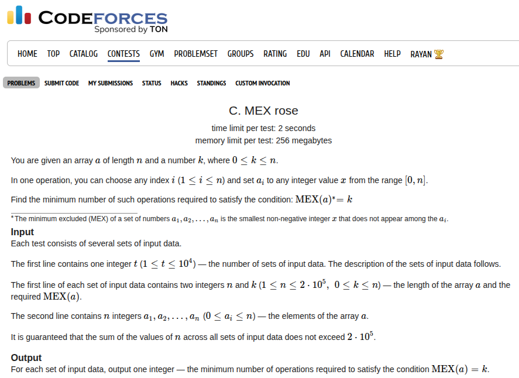

## Problem Statement <a href="https://codeforces.com/contest/2149/problem/C">[Link]</a>



## Wrong Answer on Test 2
I think this is where I lost the momentum in the contest. I carelessly coded up a wrong solution. I'll walk through the idea and point out where I missed the observation. The problem says, you are given `n` integers and you want to count the minimum number of operations so that the `mex` of the array is `k`. 

We can compute the `mex` of the array in `O(N)`. if this turns out to be `k` then we are already done. Otherwise this is either going to more than `k` or less than `k`. If it's more than `k`, which means we just have to remove all the `k`. so the answer would be `freq[k]`. If it's less than `k` then we want to add atleast one count to all the numbers smaller than `k` and in that process if we find that `freq[k] > 0` then it is optimal to switch these first to fill the lower numbers and then add the remaining count.

So this last conclusion was where I messed up. I had to think this through man. Wasted penalty on this for no reason.

### Implementation
```c++
void solve() {
    ll n, k;
    std::cin >> n >> k;
 
    std::vector<ll> a(n + 1, 0);
    std::map<ll, ll> mp;
    for (ll i = 1; i <= n; i++) {
        std::cin >> a[i];
        mp[a[i]]++;
    }
 
    ll cnt = 0;
    for (ll i = 0; i < k; i++) {
        if (mp[i] == 0) cnt++;
    }
 
    if (mp[k]) {
        if (cnt == 0) {
            cnt += mp[k];
        } else {
            cnt += std::max(mp[k] - cnt, 0LL);
        }
    }
    std::cout << cnt << '\n';
}
```

Submission Link: https://codeforces.com/contest/2149/submission/340404959
