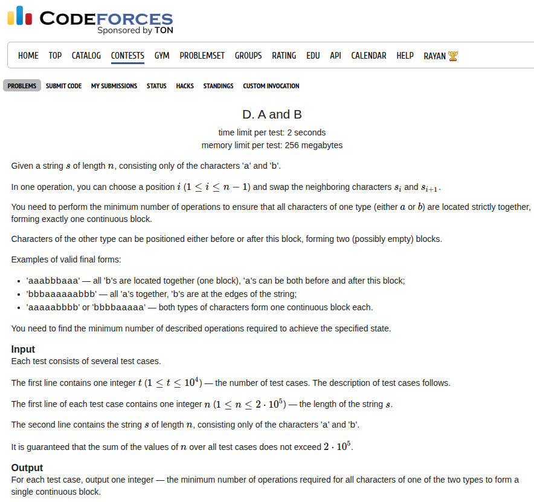

## Problem Statement <a href="https://codeforces.com/contest/2149/problem/D">[Link]</a>



## Wrong Answer on Test 2 again
Now unlike the last time, this time I had a wrong answer on test 2 because of a very stupid reason. Let's talk about the problem logic first. If you want to minimise the number of operations to make the sequence a characters a contiguous sequence, it is optimal to move them to the median. But you will have to do this for both the characters because we can have either `A` or `B` in the middle. So I implemented this for character `A` and then copied the code for character `B` but I forgot to remove the `LLONG_MAX` initialisation for the answer so basically it just resets my calculation after code for `A` and that was gave me a wrong answer penalty

I still don't think my implementation is the best implementation though, but anyway

### Implementation
```c++
void solve() {
    ll n;
    std::cin >> n;
 
    std::string s;
    std::cin >> s;
 
    std::vector<ll> tmp;
    for (ll i = 0; i < n; i++) {
        if (s[i] == 'a') {
            tmp.push_back(i + 1);
        }
    }
 
    if (tmp.size() == 0 || tmp.size() == n) {
        std::cout << 0 << '\n';
        return;
    }
 
    ll mid = tmp[(tmp.size()) / 2] - (tmp.size()) / 2;
 
    ll best = LLONG_MAX;
    ll ans = 0;
    for (ll i = 0; i < tmp.size(); i++) {
        ans += abs(tmp[i] - mid);
        mid++;
    }
 
    best = std::min(best, ans);
    mid = tmp[(tmp.size() - 1) / 2] - (tmp.size() - 1) / 2;
    ans = 0;
    for (ll i = 0; i < tmp.size(); i++) {
        ans += abs(tmp[i] - mid);
        mid++;
    }
 
    best = std::min(best, ans);
    tmp.clear();
 
    for (ll i = 0; i < n; i++) {
        if (s[i] == 'b') {
            tmp.push_back(i + 1);
        }
    }
 
    mid = tmp[(tmp.size()) / 2] - (tmp.size()) / 2;
    ans = 0;
    for (ll i = 0; i < tmp.size(); i++) {
        ans += abs(tmp[i] - mid);
        mid++;
    }
 
    best = std::min(best, ans);
    mid = tmp[(tmp.size() - 1) / 2] - (tmp.size() - 1) / 2;
    ans = 0;
    for (ll i = 0; i < tmp.size(); i++) {
        ans += abs(tmp[i] - mid);
        mid++;
    }
 
    best = std::min(best, ans);
 
    std::cout << best << '\n';
}
```

Submission Link: https://codeforces.com/contest/2149/submission/340433951
