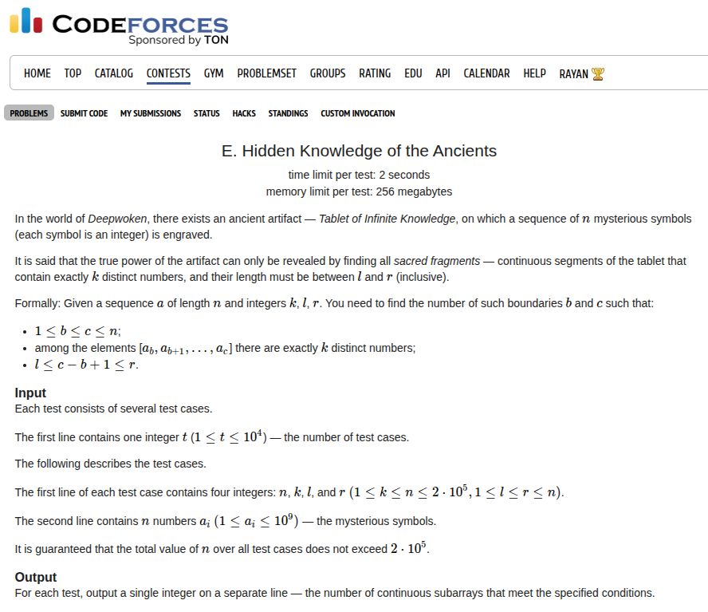

## Problem Statement <a href="https://codeforces.com/contest/2149/problem/E">[Link]</a>



## Thought Process
I had like two wrong penalties on this one and I really don't even get it what am I doing wrong. We need to maintain the count for number of subarrays. One of the most popular tricks to do that is to fix the right-most end and count the number of left endpoints. Since we only have to calculate the number of subarrays with length between `l` and `r`, therefore for a fixed endpoint `y`, we can only accept left endpoints in the range `[y - r + 1, y - l + 1]` inclusive ofcourse.

Now we just need to compute the leftmost and rightmost value for the left endpoint such that the range `[l1, y]` and `[l2, y]` both have `k` distinct elements. Then we just slice the range `[l1, l2]` using `[y - r + 1, y - l + 1]` and then we can compute this answer for `y`. If we move `y` forward and the number of distinct elements don't change, we can just use the previous answer. If it changes, it will increase by one, so now we to compute our next ranges of `[l1, l2]` and this should be a linear time algorithm since are only moving forward with two pointers.

### Wrong Implementation

Now I don't really know what is wrong here, but I'll try to think about it. I'm pasting my wrong implementation here first. Usually debugging wrong logic is very difficult because of how convincing it sounds. So I'm gonna think about my approach and code it again from scratch. 

```c++
void solve() {
    ll n, k, left, right;
    std::cin >> n >> k >> left >> right;

    std::vector<ll> a(n + 1, 0);
    for (ll i = 1; i <= n; i++) {
        std::cin >> a[i];
    }

    std::map<ll, ll> mp;
    ll l_prev = 1, l_curr = 1;
    ll ans = 0;

    ll exceeds = false;
    for (ll r = 1; r <= n; r++) {
        mp[a[r]]++;

        bool changed = false;
        while (mp.size() > k) {
            exceeds = true;
            changed = true;
            mp[a[l_prev]]--;
            if (mp[a[l_prev]] == 0) {
                mp.erase(a[l_prev]);
            }
            l_prev++;
        }

        if (changed || !exceeds) {
            l_curr = l_prev;
            while (mp.size() == k) {
                mp[a[l_curr]]--;
                if (mp[a[l_curr]] == 0) {
                    mp.erase(a[l_curr]);
                }
                l_curr++;
            }

            for (ll j = l_prev; j < l_curr; j++) {
                mp[a[j]]++;
            }
        }

        if (mp.size() == k) {
            ll l1 = std::max(l_prev, r - right + 1);
            ll l2 = std::min(l_curr, r - left + 2);
            // std::cout << l1 << ' ' << l2 << ' ';
            ans += std::max(0LL, l2 - l1);
        }

        // std::cout << r << ' ' << ans << '\n';
    }

    std::cout << ans << '\n';
}
```

### Debugging the Code

I'm pretty confident that my approach is correct, I just feel like I'm making a mistake while implementing this. I still think using a map is a good idea for maintaining the counts.

OH WHAT I FINALLY DID IT. YAY LESSGOOOO THIS WAS SOO AMAZING. THE IDEA IS TWO POINTERS!

wow man this was so sweaty oh god. i'll write down the idea quickly. it is basically what I wrote above, but the correct way to implement this is using two maps. for the first map would store the elements and try to keep it such that it always maintains the leftmost border for `mp.size() == k` and the other map would always try to keep the elements such taht it maintaints thr leftmost border for `mp.size() == k - 1`. 

so if we know the two pointers `l1, l2` that correspond to these boundaries of the first and the second map, we can get the answer by just slicing the valid range as:
```c++
left_border = std::max(r - right + 1, l1);
right_border = std::min(r - left + 1, l2 - 1);
ans += std::max(0LL, right_border - left_border + 1);
```

for the first map, we always want to check if `mp.size() > k` and if it is, then move forward the pointer
```c++
while (mp1.size() > k && l1 <= n) {
    mp1[a[l1]]--;
    if (mp1[a[l1]] == 0) {
        mp1.erase(a[l1]);
    }
    l1++;
}
```

for the second map, we always want to check if `mp.size() == k` and if that is true, we move forward the pointer until it is not
```c++
while (mp2.size() == k && l2 <= n) {
    mp2[a[l2]]--;
    if (mp2[a[l2]] == 0) {
        mp2.erase(a[l2]);
    }
    l2++;
}
```

this is for the left pointer. for the right pointer, we just move it forward and when we do that want to update both the maps with this new element at index `r` and then compute the answer keeping `r` fixed! This was so beautiful and brilliant

```c++
void solve() {
    ll n, k, left, right;
    std::cin >> n >> k >> left >> right;

    std::vector<ll> a(n + 1, 0);
    for (ll i = 1; i <= n; i++) {
        std::cin >> a[i];
    }

    std::map<ll, ll> mp1, mp2;
    ll l1 = 1, l2 = 1, r = 1;
    while (mp1.size() < k && r <= n) {
        mp1[a[r]]++;
        mp2[a[r]]++;
        r++;
    }
    
    while (mp2.size() == k && l2 <= n) {
        mp2[a[l2]]--;
        if (mp2[a[l2]] == 0) {
            mp2.erase(a[l2]);
        }
        l2++;
    }

    ll ans = 0;
    ll left_border = std::max(r - right, l1);
    ll right_border = std::min(r - left, l2 - 1);
    ans += std::max(0LL, right_border - left_border + 1);

    for (; r <= n; r++) {
        mp1[a[r]]++;
        mp2[a[r]]++;

        while (mp1.size() > k && l1 <= n) {
            mp1[a[l1]]--;
            if (mp1[a[l1]] == 0) {
                mp1.erase(a[l1]);
            }
            l1++;
        }

        while (mp2.size() == k && l2 <= n) {
            mp2[a[l2]]--;
            if (mp2[a[l2]] == 0) {
                mp2.erase(a[l2]);
            }
            l2++;
        }

        left_border = std::max(r - right + 1, l1);
        right_border = std::min(r - left + 1, l2 - 1);
        ans += std::max(0LL, right_border - left_border + 1);
    }

    std::cout << ans << '\n';
}
```

AND THAT FUCKING WORKS! LESSGOOOO
Submission Link: https://codeforces.com/contest/2149/submission/340558677
