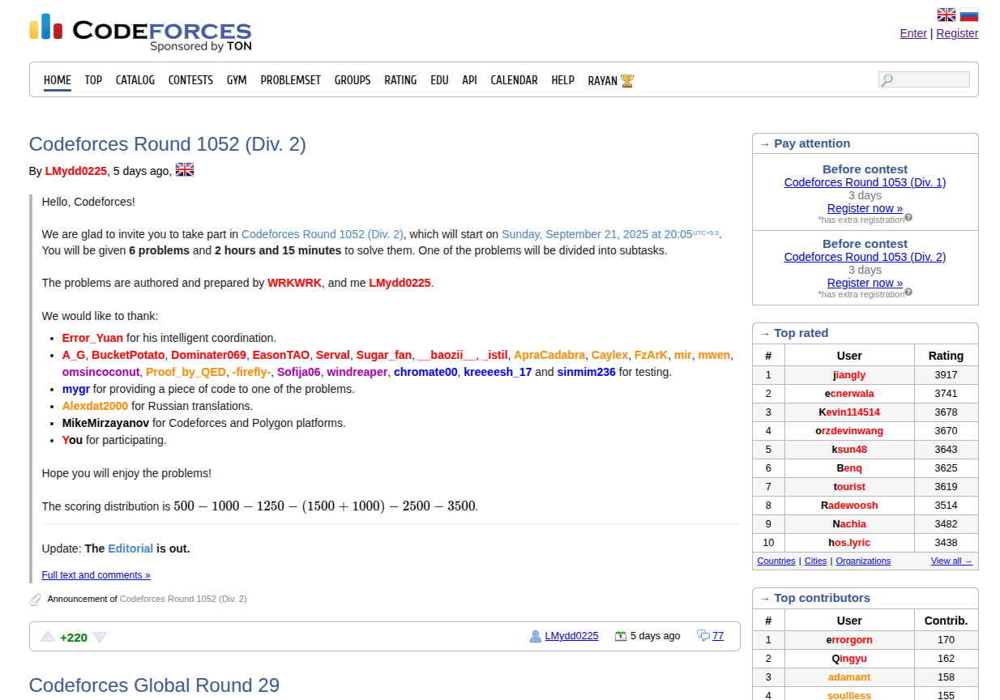

Codeforces is one of the most popular online judges for competitive programming with a very huge and rich problemset and frequent contests held on the platform. Since, I really like the problems here, I've decided to start doing all these problems (contest by contest). I've been practising on Codeforces ever since the very beginning of my Competitive Programming journey and my major practice strategy would be to solve problems around my rating. But I saw a very slow growth and my performance in contests would be quite stagnant. Lately, I feel like solving problems by contests is a much more beneficial strategy and that's what I'm going to do. 

It's been a long time since I practised again on Codeforces. I took a break from Competitive Programming in early August, 2024 due to major burnout. I practised a lot but I didn't really see much of a progress in my skill level. It's been a year since then and I'm really rusty and in a very bad shape but I still feel motivated to get back at it.

The strategy here would be to collect the experiences and techniques from participated and upsolved contests. For the first few months, I'm going to be practising on my alt account (since, I'm really rusty and my performance would literally swoop down). Once I feel comfortable and competitive enough, I'm going to switch back to my old accounts. I expect this to happen around late November or December. 

## Participated
<table>
  <tr>
    <th>Codeforces Round 1052 (Div. 2)</th>
    <th><a href="https://codeforces.com/contest/2146">Contest Link</a></th>
    <th><a href="/competitive_programming/codeforces/codeforces-round-1052-div.-2/">Blog Link</a></th>
  </tr>
</table>

