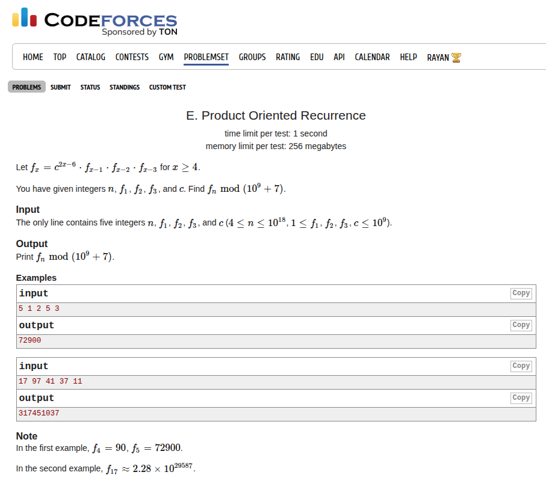

Fast Matrix Exponentiation (supports modulo and non-modulo operations)
## Fasst Matrix Exponentiation
{}
```c++
template <typename T>
class MatrixExpo {
/**
    everything is 1-indexed
    n -> size of matrix is n x n
    mod -> optional => used to perform operations modulo mod
    expo -> compute the xth power of the matrix
 */

public:
    i64 n;
    i64 mod = -1;
    std::vector<std::vector<T>> matrix;

    MatrixExpo(std::vector<std::vector<T>> vec, i64 n): 
        n(n), matrix(vec) {}

    MatrixExpo(std::vector<std::vector<T>> vec, i64 n, i64 mod):
        n(n), matrix(vec), mod(mod) {}

    // normal matrix multiplication (supports both mod and non mod)
    std::vector<std::vector<T>> multiply(const std::vector<std::vector<T>>& a, 
                                        const std::vector<std::vector<T>>& b) {
        std::vector<std::vector<T>> result(n + 1, std::vector<T>(n + 1, 0));
        
        for (i64 i = 1; i <= n; i++) {
            for (i64 j = 1; j <= n; j++) {
                T sum = 0;
                for (i64 k = 1; k <= n; k++) {
                    if (mod == -1) {
                        sum += a[i][k] * b[k][j];
                    } else {
                        sum = (sum + a[i][k] * b[k][j]) % mod;
                    }
                }
                result[i][j] = sum;
            }
        }
        return result;
    }

    // generate the identity matrix
    std::vector<std::vector<T>> identity() {
        std::vector<std::vector<T>> id(n + 1, std::vector<T>(n + 1, 0));
        for (i64 i = 1; i <= n; i++) {
            id[i][i] = 1;
        }
        return id;
    }
    
    // fast matrix exponentiation
    std::vector<std::vector<T>> expo(i64 x) {
        std::vector<std::vector<T>> result = identity();
        std::vector<std::vector<T>> base = matrix;

        while (x) {
            if (x & 1) {
                result = multiply(result, base);
            }
            base = multiply(base, base);
            x >>= 1;
        }
        return result;
    }
};
```
{}


### Codeforces 1182E (2300 rated)



here's how to use this snippet:

{}
```c++
template <typename T>
class MatrixExpo {
/**
    everything is 1-indexed
    n -> size of matrix is n x n
    mod -> optional => used to perform operations modulo mod
    expo -> compute the xth power of the matrix
 */

public:
    i64 n;
    i64 mod = -1;
    std::vector<std::vector<T>> matrix;

    MatrixExpo(std::vector<std::vector<T>> vec, i64 n): 
        n(n), matrix(vec) {}

    MatrixExpo(std::vector<std::vector<T>> vec, i64 n, i64 mod):
        n(n), matrix(vec), mod(mod) {}

    // normal matrix multiplication (supports both mod and non mod)
    std::vector<std::vector<T>> multiply(const std::vector<std::vector<T>>& a, 
                                        const std::vector<std::vector<T>>& b) {
        std::vector<std::vector<T>> result(n + 1, std::vector<T>(n + 1, 0));
        
        for (i64 i = 1; i <= n; i++) {
            for (i64 j = 1; j <= n; j++) {
                T sum = 0;
                for (i64 k = 1; k <= n; k++) {
                    if (mod == -1) {
                        sum += a[i][k] * b[k][j];
                    } else {
                        sum = (sum + a[i][k] * b[k][j]) % mod;
                    }
                }
                result[i][j] = sum;
            }
        }
        return result;
    }

    // generate the identity matrix
    std::vector<std::vector<T>> identity() {
        std::vector<std::vector<T>> id(n + 1, std::vector<T>(n + 1, 0));
        for (i64 i = 1; i <= n; i++) {
            id[i][i] = 1;
        }
        return id;
    }
    
    // fast matrix exponentiation
    std::vector<std::vector<T>> expo(i64 x) {
        std::vector<std::vector<T>> result = identity();
        std::vector<std::vector<T>> base = matrix;

        while (x) {
            if (x & 1) {
                result = multiply(result, base);
            }
            base = multiply(base, base);
            x >>= 1;
        }
        return result;
    }
};

void solve() {
    ll n, r, q, p, c;
    std::cin >> n >> r >> q >> p >> c;

    std::vector<std::vector<ll>> expoc(6, std::vector<ll>(6, 0));
    expoc[1][1] = 1; expoc[1][2] = 1; expoc[1][3] = 1; expoc[1][4] = 1;
    expoc[2][1] = 1; expoc[3][2] = 1; expoc[4][4] = 1; expoc[4][5] = 2; expoc[5][5] = 1;

    std::vector<std::vector<ll>> expon(4, std::vector<ll>(4, 0));
    expon[1][1] = 1; expon[1][2] = 1; expon[1][3] = 1;
    expon[2][1] = 1; expon[3][2] = 1;

    MatrixExpo<i64> finalc(expoc, 5, MOD1 - 1);
    std::vector<std::vector<ll>> resultc = finalc.expo(n - 3);

    MatrixExpo<i64> finaln(expon, 3, MOD1 - 1);
    std::vector<std::vector<ll>> resultn = finaln.expo(n - 3);

    ll final_ans = 0;
    final_ans += binpow(c, resultc[1][4] * 2 + resultc[1][5], MOD1);
    final_ans %= MOD1;

    final_ans *= binpow(p, resultn[1][1], MOD1);
    final_ans %= MOD1;

    final_ans *= binpow(q, resultn[1][2], MOD1);
    final_ans %= MOD1;

    final_ans *= binpow(r, resultn[1][3], MOD1);
    final_ans %= MOD1;

    std::cout << final_ans << '\n';
}
```
{}

Submission Link: https://codeforces.com/contest/1182/submission/341156114

