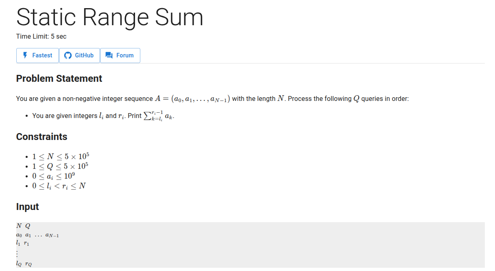

we will start by understanding what we mean by prefix sums and then look at a motivating example for the same.

## Intuition
the word "prefix" means considering a contiguous sequence of elements from the leftmost end. similarly, the word "suffix" means that we consider a contiguous sequence of elements from the rightmost end. 

so, "prefix sum" means that we sum up all the elements in a particular prefix. this idea helps us save computation cost and we will see why.

Let's define the prefix sum array for an array $A$ to be $p$ where 

$$
p[i] = \sum_{j = 1}^{i} A[j]
$$

### Computation Cost
So how quickly can we compute the prefix sum array of an array $A$. Well, this can be done in linear time because

$$
p[i] = \sum_{j = 1}^{i} A[j] = p[i - 1] + A[i]
$$

### Why do we care?
Prefix sums have the property to compute the sum of any subarray in constant time. Say we want to compute the sum of elements from $L$ to $R$, then we just compute 

$$
\sum_{i=L}^{R} A[i] = \sum_{i = 1}^{R} A[i] - \sum_{i = 1}^{L-1} A[i] = p[R] - p[L - 1]
$$

this helps us answer, subarray sum queries in constant time with just a linear time precomputation.

## Static Range Sum



### Naive Computation
if we compute this naively, summing up while iterating from index $l$ to index $r$ would take us on average $O(N)$ time. For $Q$ such queries, we are going to require $O(NQ)$ time.

### With Prefix Sums
if we use prefix sums, we just need a pre-computation to construct the prefix sum array that takes $O(N)$ time. Each query hereforth could be answered in $O(1)$ and therefore this optimises our algorithm to $O(N+Q)$ time complexity. 

### Code
here's an implementation of the above idea.
{}
```c++
#include <iostream>
#include <vector>

int main() {
    int n, q;
    std::cin >> n >> q;

    std::vector<int> a(n + 1);
    for (int i = 1; i <= n; i++) {
        std::cin >> a[i];
    }

    std::vector<int> pref(n + 1);
    for (int i = 1; i <= n; i++) {
        pref[i] = pref[i - 1] + a[i];
    }

    for (int i = 1, l, r; i <= q; i++) {
        std::cin >> l >> r;
        std::cout << (pref[r] - pref[l - 1]) << '\n';
    }
}
```

{}

### Bonus

  C++ Standard Template Library (STL) implements prefix sums. You can use this using `std::partial_sum` which is in the `numeric` header


{}
```c++
#include <iostream>
#include <vector>
#include <numeric>

int main() {
    int n, q;
    std::cin >> n >> q;

    std::vector<int> a(n + 1), pref(n + 1);
    for (int i = 1; i <= n; i++) std::cin >> a[i];

    std::partial_sum(a.begin() + 1, a.end(), pref.begin() + 1);
    for (int i = 1, l, r; i <= q; i++) {
        std::cin >> l >> r;
        std::cout << (pref[r] - pref[l - 1]) << '\n';
    }
}
```
{}