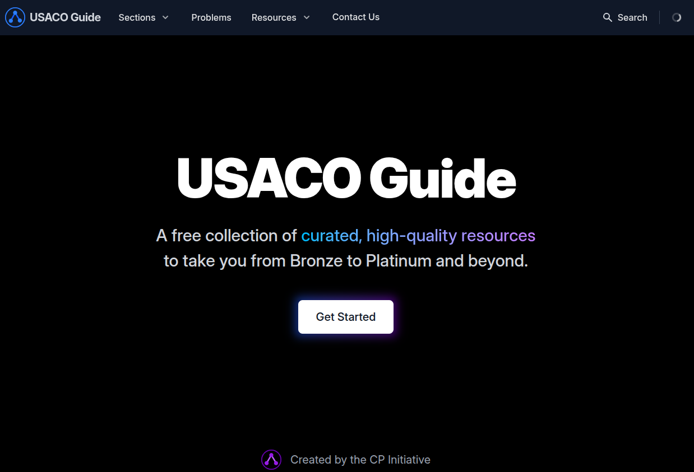

Lately, I'm having a lot of time up my sleeves and after some deep pondering in silence, I came to a realisation. Even though I started doing competitive programming 3 years ago (back in 2022), I really haven't been quite structured in my way of training. 

For example, I've never completely finished handouts, problemsets or books and I've constantly skipped or jumped on problems that felt too difficult. One of the greatest resource for competitive programming is <a href="https://usaco.guide/">USACO Guide</a> and I've not managed to even complete this. USACO Guide is split into multiple parts (with increasing order of difficulty):
1. Bronze
2. Silver
3. Gold
4. Platinum
5. Advanced

Since this is my last year of college, I want to finish incomplete things like these for my own satisfaction. Therefore, I've decided to spend some time and finish USACO Guide. I'm doing this purely out of repentment for not being able to even complete a single thing from start to end. Atleast, after I graduate, looking back I'll be able to say, "hey, at the very least I did finish the entire USACO Guide from start to end during my college years". That would be a nostalgic satisfcation. Therefore, I've decided to skip Bronze (since it's very easy) and finish all the other parts from start to end and document my journey in a series of blog posts. I hope to finish this series before I graduate :)
