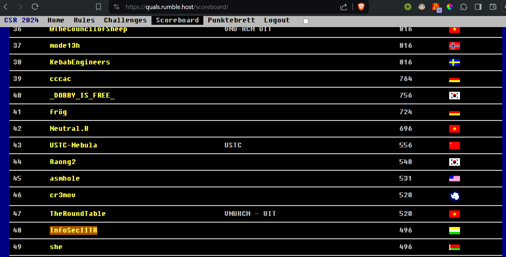

I participated with the team <a href="https://ctftime.org/team/16691/">InfoSecIITR</a>. We finished $48$th out of the $502$ teams that participated in this competition. This post shall contain the writeups for the challenges that I solved and upsolved.

|  | 
|:--:| 
| *InfoSecIITR at 48th position* |

## Writeups
### Cryptography
<table>
  <tr>
    <th>Challenge</th>
    <th>Link</th>
    <th>Solves</th>
  </tr>
  <tr>
    <th>Bigger is Better</th>
    <th><a href="./bigger-is-better">Bigger is Better</a></th>
    <th>51 solves</th>
  </tr>
  <tr>
    <th>hsm</th>
    <th><a href="./hsm">hsm</a></th>
    <th>27 solves</th>
  </tr>
</table>

### Misc
<table>
  <tr>
    <th>Challenge</th>
    <th>Link</th>
    <th>Solves</th>
  </tr>
  <tr>
    <th>GuessMyToken</th>
    <th><a href="./guessmytoken">GuessMyToken</a></th>
    <th>82 solves</th>
  </tr>
</table>

<!-- ### Cryptography

<table>
  <tr>
    <th>Challenge</th>
    <th>Link</th>
    <th>Solves</th>
  </tr>
  <tr>
    <th>Choose the Param</th>
    <th><a href="./choose-the-param">Choose the Param</a></th>
    <th>46 solves</th>
  </tr>
</table> -->
