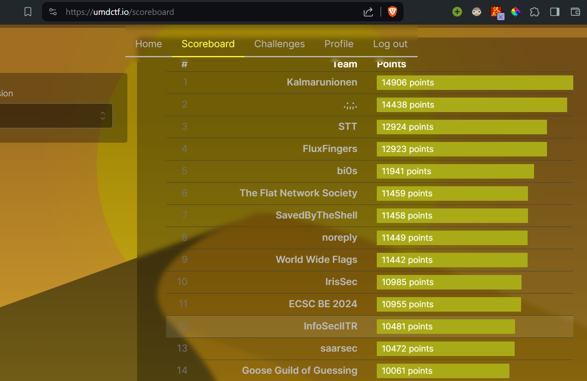

I participated in UMDCTF 2024 with the team <a href="https://ctftime.org/team/16691/">InfoSecIITR</a>. We finished $12$th out of the $562$ teams that participated in this competition. This post shall contain the writeups for the challenges that I solved and upsolved.

|  | 
|:--:| 
| *InfoSecIITR at 12th position* |

## Writeups
### Binary Exploitation
<table>
  <tr>
    <th>Challenge</th>
    <th>Link</th>
    <th>Solves</th>
  </tr>
  <tr>
    <th>The Voice</th>
    <th><a href="./the-voice">The Voice</a></th>
    <th>178 solves</th>
  </tr>
</table>

<!-- ### Cryptography

<table>
  <tr>
    <th>Challenge</th>
    <th>Link</th>
    <th>Solves</th>
  </tr>
  <tr>
    <th>Choose the Param</th>
    <th><a href="./choose-the-param">Choose the Param</a></th>
    <th>46 solves</th>
  </tr>
</table> -->
