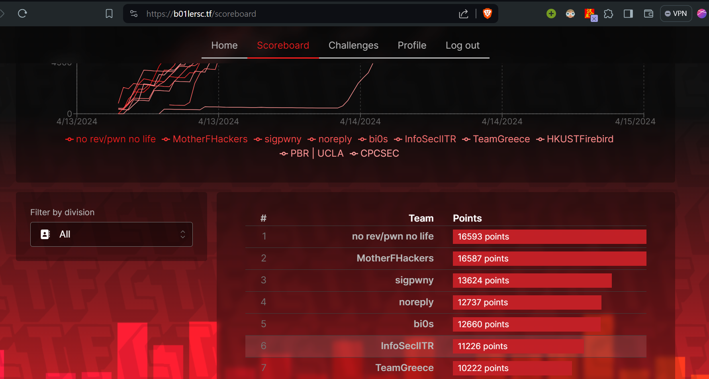

I participated in HackPack CTF 2024 with the team <a href="https://ctftime.org/team/16691/">InfoSecIITR</a>. We finished $6$th out of the $393$ teams that participated in this competition. This post shall contain the writeups for the challenges that I solved.

|  | 
|:--:| 
| *InfoSecIITR at 6th position* |

## Writeups
### Misc 
<table>
  <tr>
    <th>Challenge</th>
    <th>Link</th>
    <th>Solves</th>
  </tr>
  <tr>
    <th>Wabash</th>
    <th><a href="./wabash">Wabash</a></th>
    <th>178 solves</th>
  </tr>
  <tr>
    <th>Bash cat with pipe</th>
    <th><a href="./bash-cat-with-pipe">Bash cat with pipe</a></th>
    <th>159 solves</th>
  </tr>
</table>

### Cryptography

<table>
  <tr>
    <th>Challenge</th>
    <th>Link</th>
    <th>Solves</th>
  </tr>
  <tr>
    <th>Choose the Param</th>
    <th><a href="./choose-the-param">Choose the Param</a></th>
    <th>46 solves</th>
  </tr>
  <tr>
    <th>Half Big RSA</th>
    <th><a href="./half-big-rsa">Half Big RSA</a></th>
    <th>45 solves</th>
  </tr>
  <tr>
    <th>Shamir for dummies</th>
    <th><a href="./shamir-for-dummies">Shamir for dummies</a></th>
    <th>13 solves</th>
  </tr>
</table>
