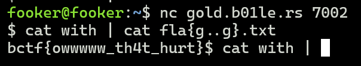
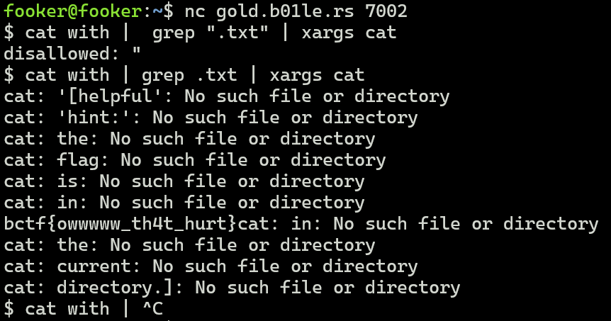

## Challenge Description

```
My terminal seems to be stuck... please help me fix it!
```
## Challenge Files
```python
#!/usr/local/bin/python3

import subprocess

prefix = 'cat with |'
ban_list = ['?', '||', '&&', 'flag', ';', '-', '[', ']', '*', '"', "'", '\\', '`', '$']


def run_input():
    inp = input(f'$ {prefix} ')

    for banned in ban_list:
        if banned in inp:
            print(f'disallowed: {banned}')
            return

    subprocess.call(f'{prefix} {inp}', shell=True, executable='/bin/bash')


while True:
    run_input()
```


The participants were NOT provided with the challenge files. This was the file they were using and had been running on their server. I retrieved this file from their server for educational (writeup) purposes. 


## Solution 
If we type in `ls`, it immediately shows us the contents of the current directory. Following this with `cat run` provides us with the script thats running on their server. From here, there are several approaches.

### Using Brace Expressions 
In bash, brace expressions allow us to generate strings or expressions without having to explicitly state them. These are a few ways in which they could be used:


- `Basic Form: {x, y, z}`: This will expand to each comma-separated item, generating a list. For example, {apples,bananas,oranges} will expand to apples, bananas, and oranges.

- `Ranges: {x..z}`: This will expand to each item in the specified range. For example, {1..5} will expand to 1, 2, 3, 4, and 5.

- `Combining Forms`: You can combine the basic form and ranges. For example, {1..3, 5, 7} will expand to 1, 2, 3, 5, and 7.

- `Nesting`: You can also nest brace expansions. For example, {a{1, 2}, b{3, 4}} will expand to a1, a2, b3, and b4.


We notice that they've only blacklisted the string `flag`. This could easily be bypassed with 
```python
cat fla{g..g}.txt
```


### Using xargs
In bash, `xargs` takes stdin and passes it as an argument. Hence if we pipe in the file `flag.txt` into `cat`, then that would read the file for us. There are several ways to do this 
```python
ls | xargs cat
```
```python
find . | xargs cat
```
```python 
grep .txt | xargs cat
```


## Flag
```
bctf{owwwww_th4t_hurt}
```