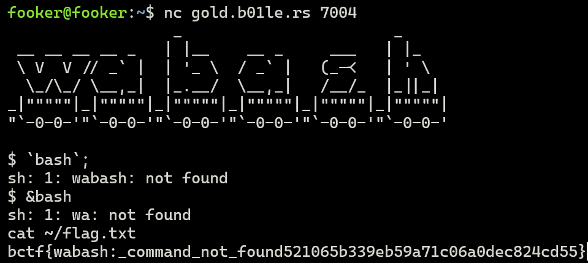
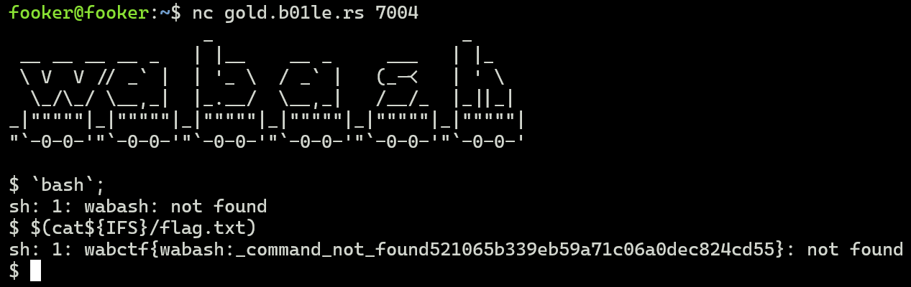

## Challenge Description

```
wabash, its a river, but also a new shell! Flag is in /flag.txt
```
## Challenge Files
```python
#!/usr/local/bin/python3

import os
import time

def wabash(command:str):
    command = command.split()
    for i in range(len(command)):
        command[i] = "wa"+command[i]
        command[i] = command[i].replace(";", "")
        command[i] = command[i].replace("`", "")
    return " ".join(command)

def slowprint(s):
    for c in s + '\n':
        print(c, end='', flush=True)
        time.sleep(0.1)

print(r'''                  _                       _
 __ __ __ __ _   | |__    __ _     ___   | |_
 \ V  V // _` |  | '_ \  / _` |   (_-<   | ' \
  \_/\_/ \__,_|  |_.__/  \__,_|   /__/_  |_||_|
_|"""""|_|"""""|_|"""""|_|"""""|_|"""""|_|"""""|
"`-0-0-'"`-0-0-'"`-0-0-'"`-0-0-'"`-0-0-'"`-0-0-'
''')
slowprint("$ `bash`;")
print("sh: 1: wabash: not found")
while True:
    os.system(wabash(input("$ ")))
```


The participants were NOT provided with the challenge files. This was the file they were using and had been running on their server. I retrieved this file from their server for educational (writeup) purposes. 


## Solution 
After playing around a bit, we realise that the server is prepending `wa` to our input and that's getting executed by the shell. `Bash` in particular is a UNIX Shell and command language written for GNU's shell. So, we use some bash tricks to solve this challenge. 

### Using the Ampersand Operator (&)
In bash, the ampersand operator is used to terminate an asynchronous command. This means, that bash would execute this command in the background and run the next command following the `&` operator without waiting for the former to end. 

Therefore, if we execute something like 
```python
&bash
```
or 
```python
&($0)
```
This runs the `wa` command in the background and provides us a shell access. Then we can simply execute `cat ~/flag.txt` or `cat /flag.txt` to get the flag.


### Using Command Substitution ($())
In bash, using `$()` allows us to execute anything within the parantheses inside a subshell and replace the command by the output generated. There's also an internal variable in bash known as the `Internal Field Separator`, which when used in a bash command ensures that the operands are treated as a part of a single command even though white-spaces are introduced. The syntax to use it is: `${IFS}`.

Therefore, if we execute something like 
```python
$(cat${IFS}/flag.txt)
```
This executes the command inside (which grabs the flag) and replaces it with the command to be executed. 



The dollar parameter expands into the Process ID of the Bash process. If you want to ever execute command substitution on your terminal, then you would do `(ls)` instead of `$(ls)` because the terminal prepends `$` to each of your commands. However, in the above challenge, the python script would execute the resultant string as a whole. 


## Flag
```
bctf{wabash:_command_not_found521065b339eb59a71c06a0dec824cd55}
```
### References:
https://mywiki.wooledge.org/BashSheet#:~:text=An%20ampersand%20does%20the%20same,for%20the%20former%20to%20end