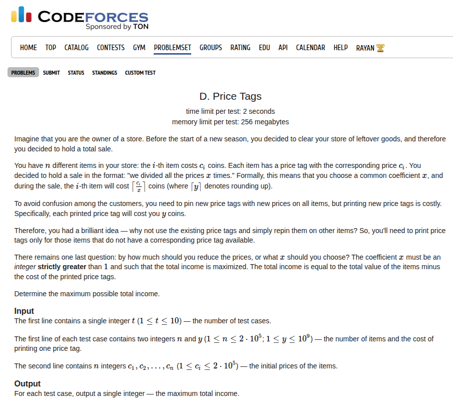

Welcome to the "Series of Secret Blog Posts". I will be using this page as the main page for branching off all the other secret links that capture all of my journals.

## 16th September, 2025
This is where you should be heading <a href="/secret/getting-too-rusty">to</a>, if you'd like to know a reason behind this series of blog posts.

## 17th September, 2025
I had applied for the role of a Software Engineer at Stripe two weeks ago. I sent my resume and waited. Today, I received a mail that said that I've been shortlisted for the selection process and the first round is a screening round. <a href="/stripe_invitation.pdf">It</a> says that, this is a coding challenge and I will be given 60 minutes to code and submit the solution. 

From what I've heard, Stripe focuses more on clean implementation rather than heavy, complex algorithms. So, my best guess is that this is going to be an implementation challenge. I'll be practising a bit for the same and I'm gonna document this before I take the test. After taking the test, I'll document my experience again in a follow-up post. 

<a href="/secret/stripe/implementation">Practising a few Implementation based challenges</a>

## 18th September, 2025
I have decided to rigorously study the entire USACO Guide for competitive programming. I'm going to document all that <a href="/competitive_programming/usaco-guide">here</a>, which is a series of public blog posts (I don't see any reason as to why I should be keeping this private). 

## 19th September, 2025
I haven't really had the chance to clear up the python mess on my system. For some context, I use Ubuntu 24.04 and for some reason the traditional way i worked with python before doesn't quite work on this system. On top of that I had a lot of mess on my system. Default imports would route to site-packages inside some virtual environment that is not even related to my current project. I would cringe so hard looking at wtf is happening and finally I could no longer take it and decided to fix my system setup once and for all.

In <a href="blogs/python-virtual-environments/">this</a> post I dive deeper into the python system internals and explore the best option for my system setup.

## 20th September, 2025
I'm still waiting for the results of the Stripe Coding Challenge. Actually the deadline for that challenge was till monday evening, so I'm guessing we will hear about it after that.

Today we have two contest, AtCoder Beginner Contest at 5:30pm and Codeforces Global Round at 8:00 pm. I think I might not be able to do the Codeforces Round because it clashes with my sleep timings and also I might be very tired doing back to back contests. Also, I'm kinda prioritising AtCoder at the moment, because my rating curve is still climbing on AtCoder. I think I'm early blue on AtCoder but let's see. 

I decided to do virtual ABC Contests, I attempted ABC 126 <a href="/competitive_programming/atcoder/abc126/">here</a>.

UPD: <a href="/competitive_programming/atcoder/abc424/">here</a>'s my AtCoder ABC 424 experience! 

## 21st September, 2025
Today I realised that I can actually replace all the dopamine activities in my life with LeetCode problems. Everytime I feel like, I want to watch Youtube Shorts? Nah, Do LeetCode Easy. I want to scroll on Instagram! Nah, Do LeetCode Easy. I want to waste time laying on the bed? NAH DO LEETCODE EASY!

LeetCode Easy is the new dopamine hit in the market gang. y'all need to try it out.

Later today I appeared for <a href="/competitive_programming/codeforces/codeforces-round-1052-div.-2/">Codeforces Round 1052 (Div. 2)</a> and I think I could have really done better.

## 25th September, 2025
For the past few days, I've been grinding cp problems a lot. I took part in three more rounds, did a couple of virtual contests. I'm gonna constantly update these in the <a href="/competitive_programming/">Blog</a>.

I'm still a bit scared that I'm not preparing enough for the Stripe rounds. I really haven't heard from them yet. But I just hope that if I do, it isn't on a really short notice.

## 26th September, 2025
I interviewed a candidate for PAG Round 2 selections and my brain is fucking cooked. It's been so long since I did problems greater than > 1700 rating. Even though I know rating is just a number, I believe it does have a correlation with the complexity of the problem. I had to ask problems on the ranges 1700 to 2000 and even trying to argue or check the correctness of the proposed solution of the candidate is difficult because you need to be able to come up with counter examples quickly. AAAAAAAAA my brain hurts.

## 27th September, 2025
I think the PAG rounds did something to me. I woke up today and I solved an 1800 problem. Well I was stuck initially and had no idea how to proceed so I opened up the editorial and read the first line and it immediately struck me how to do it. I just read the line `we know floor(a_i/x) <= floor(max(a)/x), so if we could compute the answer for each x in O(floor(max(a)/x)) time then we will be able to compute the total answer in O(AlogA) where A = max(a)`. So then I thought about it and I was immediately able to figure out the solution using some prefix sums and tricks.

this is the problem 

## Price Tags <a href="https://codeforces.com/problemset/problem/2144/D">[CF 2144D]</a>


I initially got a wrong answer but that was because I wasn't careful with my bounds. Then I fixed it and it worked!

{}
```c++
void solve() {
    ll n, y;
    std::cin >> n >> y;
    std::vector<ll> c(n + 1, 0);
    for (ll i = 1; i <= n; i++) {
        std::cin >> c[i];
    }

    std::sort(begin(c) + 1, begin(c) + n + 1);

    std::vector<ll> freq(TOTAL_NUM + 2, 0LL);
    for (ll i = 1; i <= n; i++) {
        freq[c[i]]++;
    }

    std::vector<ll> pref(TOTAL_NUM + 2, 0LL);
    for (ll i = 1; i <= TOTAL_NUM + 1; i++) {
        pref[i] = pref[i - 1] + freq[i];
    }

    ll ans = LLONG_MIN;
    for (ll x = 2; x <= TOTAL_NUM + 1; x++) {
        ll sum = 0, cnt = 0;
        for (ll i = 1; i <= (c[n] + x - 1) / x; i++) {
            sum += i * (pref[std::min(TOTAL_NUM + 1, i * x)] - pref[(i - 1) * x]);
            cnt += std::min(freq[i], pref[std::min(TOTAL_NUM + 1, i * x)] - pref[(i - 1) * x]);
        }
        ans = std::max(ans, sum - y * (n - cnt));
    }

    std::cout << ans << '\n';
}
```
{}

Submission Link: https://codeforces.com/contest/2144/submission/340692892

## 29th September, 2025
I wrote my sparse table class template. I've added that in the Snippets section <a href="/competitive_programming/snippets/sparsetable">here</a>.

## 30th September, 2025
Hell yeah I got the invitation for the next round for Stripe. I'll detail this in this <a href="/secret/stripe/tech-screening">post</a>
