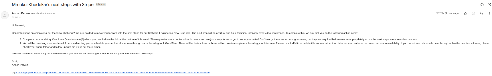
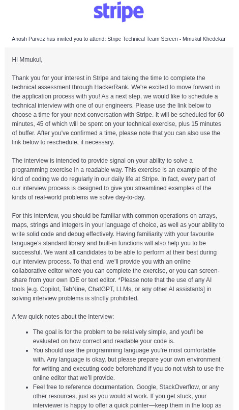
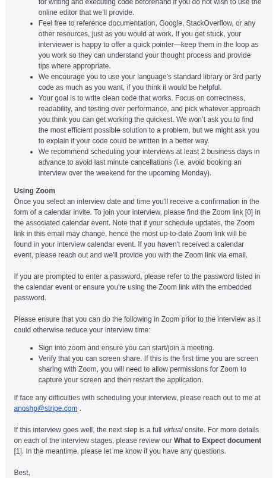
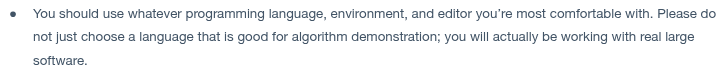

I took the Stripe Coding Challenge on 17th September and it went quite good. I was able to pass all the tests cases with a clean code within the given time limit and submit the solution. I was very hopeful and happy about this and I was eagerly waiting to hear from the about the next rounds. My other friend who also appeared for the Stripe Coding Challenge was only able to pass 12/13 testcases. We both were waiting for the results and hoping to hear from them soon. About 2 weeks later, today I received a mail from them (actually a series of mails). 

The first mail says



It congratulates me for completing the technical challenge and they want to move forward with me with the next steps of the recruitment process. The next step is a virtual one hour technical interview about which they have detailed in the next mail. 





Along with that I get a pdf stating what to Expect from the `SWE - Team Screen` round. I'm attaching the pdf <a href="stripe-team-screen.pdf">here</a>. I'll go over what they are trying to say here. So the next round, which is the team screening round will be a technical interview lasting for 1 hour where I'll have to solve a programming exercise and implement it in a readable way and also convey my thoughts to the interviewer.

It says that for this interview I should be familiar with the common operations on arrays, maps and strings and interfers in your language of choice. So my plan is that I'm gonna spend today's night reading about C++ STL and Python data structures. Let's familiarise ourselves with the tools that we need to use for the next round and meanwhile I've dropped a text to my senior at Stripe. I'll ask her what all should I prepare in order to maximise my chances (for the next rounds assuming I don't have enough time up my sleeves and I clear the team-screening).

It says that they will evaluate me on the correctness and readability of the code. They wont be asking me to find the most efficient solution, but they just want me to be able to quickly get the approach working and explain my code in a better way.

Something that caught my eye in the pdf is this line: 


So does that mean it's not going to be a very conventional type of challenge? I don't know, I'll be very prepared for any scenario. If it's something to do with HTTP requests, I might have to switch to Python. Doing any kind of network stuff in C++ is a nightmare. 

And another thing here:


What does it mean to "then test it"? do I really have to be familiar with writing tests for my code now? I'll have to learn a testing framework in Python (worst case preparation). 


Oh god, are they hinting to not choose c++? I think I should be very prepared to this interview round in Python. I'll start studying about writing codes in python right away. Yeah, I'll probably choose python to do this interview round. 

## 6th October, 2025
I woke up early today and prepared myself mentally for the tech screening round. I joined the zoom meeting link a few minutes before 9 and waited. The interviewer joined and we talked for the next 10 minutes about ourselves and the round and the setup. I told him that I have a monitor so he told me to mirror the monitor. I did that and then he shared a hackerrank link at `9:10 am`. I opened the link and started reading the problem.

### Problem 1
the first problem seemed very easy. you have to calculate the shipping cost of an order which is cost times quantity for each product. I chose python and I was a bit confused about the input format since the question was not making that clear. I asked the interviewer a few questions about the input format and then started coding this.

In my first attempt I coded this out
```py
def calculate_shipping_cost(order, shipping_cost):
    cost = 0
    products = order["items"]
    

    return cost
```

then I realised that we actually have to go over the entire `shipping_cost` matrix and check if the country code matches the country code on the order. so I wrote this brute force approach. I made a comment about that I have an inefficient idea and this could be optimised further, but I just wrote this out.

```py
def calculate_shipping_cost(order, shipping_cost):
    cost = 0
    products = order["items"]
    country_name = order["country"]

    for product_list in shipping_cost:
        if product_list["country"] == country_name:
            for product in product_list["products"]:
                product_name = product["name"]
                cost += products[product_name]["quantity"] * product[cost]

    return cost
```

then I run this and I got an error and I couldn't figure out what was happening. I first thought that it was a `str` multiplication interpreted for integer. but then  I read the error and it said `KeyError` and then I realised that I forgot to enclose `cost` in `""`

then I corrected it
```py
def calculate_shipping_cost(order, shipping_cost):
    cost = 0
    products = order["items"]
    country_name = order["country"]

    for product_list in shipping_cost:
        if product_list["country"] == country_name:
            for product in product_list["products"]:
                product_name = product["name"]
                cost += products[product_name]["quantity"] * product["cost"]

    return cost
```

and it passed the testcases. It took me about 7 minutes to do this. and the next 2 minutes the interviewer checked the code for testcase and moved forward.

### Problem 2
this problem modified the previous problem. This time you are given incremental costs. With increase in quantities the cost would differ. It gave no explanation about how the calculation for quantities was modified. I had to guess that logic from the sample examples and the input data. I misread this problem in the first go. I noticed that the quantities were split into intervals. I thought you just have to check what interval the quantity belonged to and take that cost. I implemented that and ofcourse that gave me a wrong answer. there were some null values for the max quantity so I spend a minute thinking about how to handle that and decided to just split the interval.

```py
def calculate_shipping_cost(order, shipping_cost):
    cost = 0
    products = order["items"]
    country_name = order["country"]

    for product_list in shipping_cost:
        if product_list["country"] != country_name:
            continue

        for product in product_list["products"]:
            product_name = product["name"]
            quantity = products[product_name]["quantity"]

            for cost_list in product["costs"]:
                left = cost_list["minQuantity"]
                right = cost_list["maxQuantity"]
                if right is None:
                    right = 1e18

                if quantity >= left and quantity <= right:
                    cost += quantity * cost_list["cost"]

    return cost
```

the answer was very off and I didnt realise what was happening. Then I re read the problem and realised that we have to partition the quantity into intervals and just add the costs for the intervals. I implemented this next, which was still wrong due to off by one error.

```py
def calculate_shipping_cost(order, shipping_cost):
    cost = 0
    products = order["items"]
    country_name = order["country"]

    for product_list in shipping_cost:
        if product_list["country"] != country_name:
            continue

        for product in product_list["products"]:
            product_name = product["name"]
            quantity = products[product_name]["quantity"]

            for cost_list in product["costs"]:
                left = cost_list["minQuantity"]
                right = cost_list["maxQuantity"]
                if right is None:
                    right = 1e18

                if quantity < left:
                    continue

                elif quantity >= left and quantity <= right:
                    cost += (quantity - left + 1) * cost_list["cost"]

                elif quantity > right:
                    cost += (right - left + 1) * cost_list["cost"]

    return cost
```

this still gave me a wrong answer and I wasn't understanding why. Over here I kinda lost my cool and I started panicking. I stopped explaining stuff to the interviewer about my approach and just got into debugging this. I added print statements after each loop and observed what was happening to the values. I think I wasted like 6 to 8 minutes here. The clock was `9:37 am` at this moment and I couldn't figure out why it was off. I was about to cry and give up but then I just told myself no there must be something I'm missing. I dry run the sample testcases and then I realised the error. The thing was, the first interval in the sample testcases was `(exclusive, inclusive]` and all the rest intervals were `[inclusive, inclusive]` which is why I was getting an off by one error.

I fixed this by doing this
```py
def calculate_shipping_cost(order, shipping_cost):
    cost = 0
    products = order["items"]
    country_name = order["country"]

    for product_list in shipping_cost:
        if product_list["country"] != country_name:
            continue

        for product in product_list["products"]:
            product_name = product["name"]
            quantity = products[product_name]["quantity"]

            for cost_list in product["costs"]:
                left = cost_list["minQuantity"]
                if left == 0:
                    left = 1

                right = cost_list["maxQuantity"]
                if right is None:
                    right = 1e18

                if quantity < left:
                    continue

                elif quantity >= left and quantity <= right:
                    cost += (quantity - left + 1) * cost_list["cost"]

                elif quantity > right:
                    cost += (right - left + 1) * cost_list["cost"]

    return cost
```
and this works. the interviewer spent next 2 minutes trying to change the input testcases and my code just worked for all the testcases. So the second part took about 20 minutes to do. And then was the last and the third part. I had about 10 minutes to do this becase the time was already `10:40 am` and the last 10 minutes are supposed to be kept for the behavioural stage. 

### Problem 3
In this part, you are modifying the part 2. You now have partial updates for shipping cost. depdending upon the type, if the type is `incremental` then the logic from part 2 applies or else if the type is `fixed` then no matter what
the quantity is you just add the fixed cost.

I thought this was easy so I coded this

```py
def calculate_shipping_cost(order, shipping_cost):
    cost = 0
    products = order["items"]
    country_name = order["country"]

    for product_list in shipping_cost:
        if product_list["country"] != country_name:
            continue

        for product in product_list["products"]:
            product_name = product["name"]
            quantity = products[product_name]["quantity"]

            for cost_list in product["costs"]:

                if cost_list["type"] == "fixed":
                    left = cost_list["minQuantity"]
                    if left == 0:
                        left = 1

                    right = cost_list["maxQuantity"]
                    if right is None:
                        right = 1e18

                    if quantity >= left and quantity <= right:
                        cost += cost_list["cost"]

                if cost_list["type"] == "incremental":
                    left = cost_list["minQuantity"]
                    if left == 0:
                        left = 1

                    right = cost_list["maxQuantity"]
                    if right is None:
                        right = 1e18

                    if quantity < left:
                        continue

                    elif quantity >= left and quantity <= right:
                        cost += (quantity - left + 1) * cost_list["cost"]

                    elif quantity > right:
                        cost += (right - left + 1) * cost_list["cost"]

    return cost
```

and then I tried running this and it gave me a wrong answer. I was baffled what is wrong now. Then I added print statement at the end of the for loop and checked and I realised the logic for fixed addition also accounts for quantity not in the interval. So my check was partial. I had to check if the quantity is not in the interval then continue else always add the fixed cost. 

```py
def calculate_shipping_cost(order, shipping_cost):
    cost = 0
    products = order["items"]
    country_name = order["country"]

    for product_list in shipping_cost:
        if product_list["country"] != country_name:
            continue

        for product in product_list["products"]:
            product_name = product["name"]
            quantity = products[product_name]["quantity"]

            for cost_list in product["costs"]:

                if cost_list["type"] == "fixed":
                    left = cost_list["minQuantity"]
                    if left == 0:
                        left = 1

                    right = cost_list["maxQuantity"]
                    if right is None:
                        right = 1e18

                    if quantity < left:
                        continue

                    cost += cost_list["cost"]

                if cost_list["type"] == "incremental":
                    left = cost_list["minQuantity"]
                    if left == 0:
                        left = 1

                    right = cost_list["maxQuantity"]
                    if right is None:
                        right = 1e18

                    if quantity < left:
                        continue

                    elif quantity >= left and quantity <= right:
                        cost += (quantity - left + 1) * cost_list["cost"]

                    elif quantity > right:
                        cost += (right - left + 1) * cost_list["cost"]

    return cost
```

and now this worked. all the test cases passed and the interviewer seemed fine with it too. it was `9:47 am` on the clock, I did the third part in seven minutes and for the next three minutes the interviewer tried to rigorously break my code by changing the input testcases, but it all passed.

then the next 10 minutes we spent talking about what I could have done better and then about his work and where he thinks the software industry is going with the rise of LLMs. after that it was already `10 am` and I had nothing more to ask so the interview ended.

I dont know how to feel about that. I really messed up the second part, it should have taken me about just eight minutes to do this but I spend `20 minutes` doing the second part because I misread the problem statement. That would have been so flawless, all three parts in 8 minutes each, interview fucking done in 25 minutes which is supposed to last for 45 minutes. I don't know. He did say that the parameters for judging is the correctness of code, then the speed of typing code and then the readibility. I feel like my code is very readible. I have previously received comments that I type out code GPT-like. I think the speed at which I type is also great. The only place where I messed up probably was getting it right on the first attempt which I still feel very bad about why did I do that. This was so fucking simple. I don't know. I'm just hoping for the best. I hope I get invitation for the next round. It's going to be a three part round: programming, integration round and bug squash round. I really want to qualify to these. I did all the three parts in 40 minutes to be technically right which is well within the time allotted to me so I should be good to go, but I don't know. It's all upto the interviewer. I'm just praying to god I get qualified. Let's wait and see!

## Update [17th October, 2025]
I got an invitation to the next round! This round will have a programming exercise and a debugging round. However they are asking me to sign an NDA so I don't think I can post anything about it here. But I will detail the aftermath probably.

## Update [27th October, 2025]
I completed the `Virtual Onsite` round. I'm going to write about my experience <a href="/secret/stripe/virtual-onsite">here</a>
